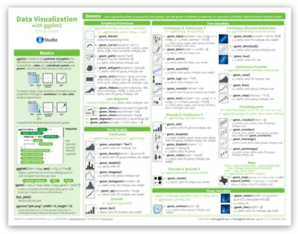
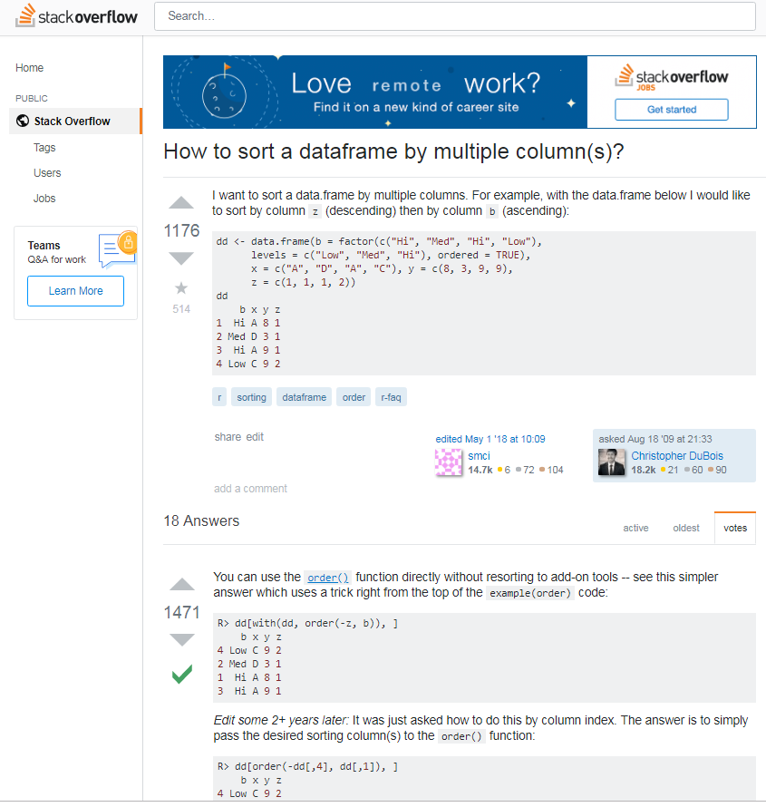
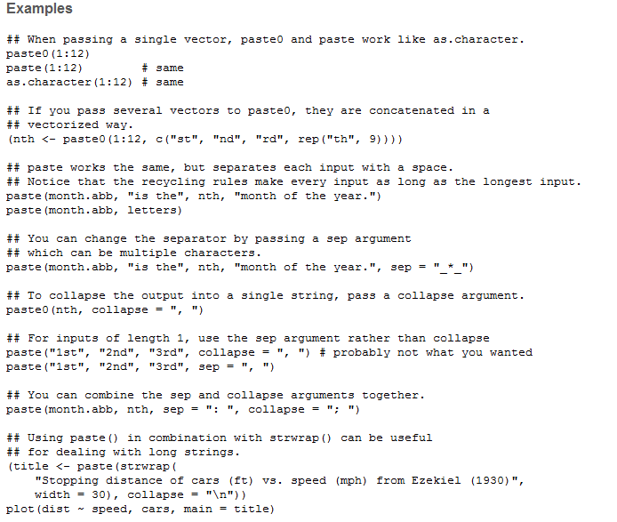
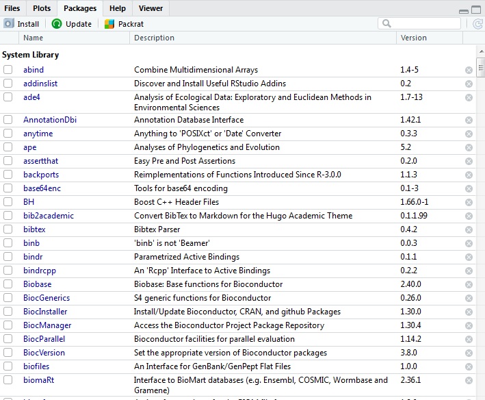

```{r setup, include=FALSE}
library("knitr")
library("kableExtra")

options(htmltools.dir.version = FALSE)
  knitr::opts_chunk$set(fig.width=6, 
                        fig.height=6, 
                        eval=TRUE, 
                        cache=TRUE,
                        echo=TRUE,
                        prompt=FALSE,
                        tidy=TRUE,
                        comment=NA,
                        message=FALSE,
                        warning=TRUE,
                        highlight=TRUE,
                        fig.show='hold')
```

```{r, echo=FALSE}
# Define a function for formatting the dataframes

 my_kable <- function(df){
   options(knitr.kable.NA = '') 
   knitr::kable(df,"latex",row.names =FALSE, booktabs=T, linesep = "") %>%
      kableExtra::kable_styling(latex_options = c("scale_down", "striped"))
   }
```

```{r, echo=FALSE}
# All presentations done with Xaringan
# Wiki : https://github.com/yihui/xaringan/wiki
# More tricks : https://arm.rbind.io/slides/xaringan.html#1

# css: [default, metropolis, metropolis-fonts, "metropolis-dv.css"]

# Styles for code highlighting : https://github.com/gnab/remark/wiki/Configuration

# Visualize : https://jmblog.github.io/color-themes-for-google-code-prettify/


```
# Fundamental of Data Science for ESS


```{r, out.width="40%", echo=FALSE, fig.align="center"}
knitr::include_graphics("img/course-logo.png")
```

## R session 01 - Introduction to R

.font120[**Daniel Vaulot**]

2019-01-17

.pull-left[
```{r, out.width="50%", echo=FALSE, fig.align="left"}
knitr::include_graphics("img/NTU-Logo-full-colour.png")
```
]

.pull-right[
```{r, out.width="50%", echo=FALSE, fig.align="center"}
knitr::include_graphics("img/logo_SBR.png")
```
]


---

background-image: url(img/R-logo.png)

# Outline

.font150[
* What is R and why use R ?
* Resources
* Get started
* Fundamentals of R
    - Data objects
    - Vectors
    - Operators
    - Functions
    - Packages
    - Data frames
]
---
layout: true

# Introduction

---

background-image: url(img/R-logo.png)


- .font150[Who has used R before ?]

--

- .font150[What other programming language have you used before ?]

--

- .font150[For those who are experts in R]

--
    * please refrain to answer during this session...
    * help your neighbor...

--

.font150[* Two special slide formatting]

.student[Your turn...]

--

.warning[Warning]

---

## Computer languages

```{r, echo=FALSE, out.width=c("100%")}
knitr::include_graphics("img/computer-languages.png")
```

---

background-image: url(img/R-logo.png)

## History of R

* **Mid 1970s** - S Language for Statistical Computing conceived by John Chambers, Rick Becker, Trevor Hastie, Allan Wilks and others at Bell Labs

* **Early 1990's** - R was first implemented in the early 1990’s by Robert Gentleman and Ross Ihaka, both faculty members at the University of Auckland. 

* **1995** - Open Source Project

* **1997** - Managed by the R Core Group

* **2000** -  First release of R

* **2011** - First release of R studio

* [Historical notes - Paper from 1998](https://www.stat.auckland.ac.nz/~ihaka/downloads/Interface98.pdf)

---
## Why use R ?

- **Script vs. Menu driven software (e.g. Excel)**
     + Can be re-rerun with new data
     + Reproducible workflow
--
- **Open source**
    + Huge number of libraries
    + Tidy "universe" : tidyverse and ggplot2
        + Very easy to manipulate tables (select columns, create new variables)
        - High quality graphics
--
- **Work environment**
    - R studio
--
-  **Document your data processing**
    - R markdown
    - Create HTML, pdf, presentations
--
- **Share your data and workflow**
    - GitHub

---
## What can you do with R ?

--

.pull-left[

- **Science**
    * Statistics of course...
    * Data processing
    * Graphics
    * Time series analyses
    * Maps
    * Bioinformatics
]

--

.pull-left[

- **But also**
    * Teach
    * Do a presentation
    * Write your CV
    * Build a web site
    * Write a book
    * Much more...
]

--
.center[
```{r, out.width="50%", echo=FALSE, fig.align="center"}

```
]

---
layout: true
# Resources

---

## Books and Manuals
.center[
```{r, echo=FALSE, out.width=c("30%", "35%")}


```
]
* [R intro](https://cran.r-project.org/doc/manuals/r-release/R-intro.pdf) : Very good introduction to R, short and clear
* [R in a nutshell](http://rbasicsworkshop.weebly.com/uploads/1/8/6/0/18603232/adler_2009_r-inanutshell.pdf) : Many many receipes to solve all your questions
* R graphics cook book : very good for graphics

---

## On line courses and web sites


```{r, fig.height=3, echo=FALSE, out.width=c("65%"), fig.align = "center"}
knitr::include_graphics("img/web_quickR.png")
```

* [Coursera](https://www.coursera.org/learn/r-programming)
*	[Pluralsight](https://www.pluralsight.com/courses/r-programming-fundamentals)
* [Quick-R, very simple](http://www.statmethods.net/)


---


## Cheat sheets 

```{r, echo=FALSE, out.width=c("50%", "50%")}



```

* [R basics](http://github.com/rstudio/cheatsheets/raw/master/base-r.pdf)
* [ggplot2](https://github.com/rstudio/cheatsheets/raw/master/data-visualization-2.1.pdf)
* [dplyr](https://www.rstudio.com/wp-content/uploads/2015/02/data-wrangling-cheatsheet.pdf)


---

## Forum

```{r, fig.width=3, echo=FALSE, out.width=c("40%"), fig.align = "center"}

```

* https://stackoverflow.com/
*	http://r-statistics.co/
*	https://stats.stackexchange.com/
*	https://www.r-bloggers.com/

---

layout: true
# Let's get started

---

## Setup

* Install [R](https://cran.r-project.org/index.html)

* Install [R studio](https://www.rstudio.com/products/rstudio/download/#download)

```{r, fig.width=3, echo=FALSE, out.width=c("80%"), fig.align = "center"}

```

---

## The R studio interface

.pull-left[

- **Bottom left**
    - Console
- **Top left**
    - File editor 
- **Top right**
    - Environment (i.e. R objects)
    - History
- **Bottom right**
    - Files
    - Plots
    - Packages
    - Help
]

.pull-rigth[
```{r, out.width="50%", echo=FALSE, fig.align="center"}

```
]

---

## Create a new project

```{r, out.width="35%", echo=FALSE, fig.align="center"}
knitr::include_graphics("img/R-new-project.png")
```

* Open R studio
* Create new project for the course in a new directory
    - e.g. Data Science Class

---

## Your first script

```{r}
print("Hello world")
```

### Two ways to proceed


1. Type directly in command window

--

2. Create a new script

```{r, out.width="35%", echo=FALSE, fig.align="center"}

```

.student[Type in script window, select and execute (CTRL-R)]


---

layout: true
# The R language

---
## Everything in R is an **object**

* Assignement done with **<-**

```{r, prompt = TRUE}
 x <- 1
 y <- 2
 x + y
```
--
```{r ,prompt = TRUE}
 z <- x + y
 z
```

---

**=** can be used instead of **<-** but refrain from it (not good style)
```{r ,prompt = TRUE}
 z = x + y
```

--

You can view the values of the objects in R-studio environment window (top-right)

```{r, out.width="55%", echo=FALSE, fig.align="center"}
knitr::include_graphics("img/R_studio-environment.png")
```

---

## R is **case sensitive**

```{r ,prompt = TRUE, eval=FALSE}
 Z
```

--

```{r ,prompt = TRUE, error=TRUE, message=TRUE, warning=TRUE}
 Z
```

---

## Rules for naming objects
* Use
    * letters
    * numbers
    * the dot
    * the underscore (not the minus sign !)
    
    
* Start always with a letter
    * `Myvariable`, `Myvariable1`, `Myvariable.1`,`Myvariable-01` are OK
    * `1Myvariable`, `My-variable`, `Myvariable@` are **not** OK

---

## Use consistent naming
Five conventions

* alllowercase: e.g. adjustcolor
* period.separated: e.g. plot.new
* **underscore_separated**: e.g. numeric_version
* lowerCamelCase: e.g. addTaskCallback
* UpperCamelCase: e.g. SignatureMethod

Prefer third one, much more easy to read
* Use **names** for objects : **last_name**
* Use **verbs** for function : **build_name**
* Think about best order
    - e.g. prefer maybe **name_last** because then you can have name_first, name_full... 
    - and you identify that all these objects are related to a name...


---
layout: true
# R objects

---

## Data types

* **character**: "Daniel", "This is a course in R", 'Donald'

* **numeric**: 2, 15.5, 10e-3

* **integer**: 2L (the L tells R to store this as an integer)

* **date**: 2018-02-25

* **logical**: TRUE, FALSE

* **complex**: 1+4i (complex numbers with real and imaginary parts)

--

* **No data** "NA"

* **Not a number** "NaN" (e.g. division by zero)

---

## Data structures

* **Vector**

* **List**

* **Matrix**

* **Data frames**

* **Function**

---
layout: true
# Vectors

---

The basic R structure is a vector: 
$$\begin{bmatrix}10 \\ 20 \\ 30 \end{bmatrix}$$

--

A vector can with a single element only
$$\begin{bmatrix}10 \end{bmatrix}$$

--
## Assign a value to a vector
```{r}
 x <- 10
 x
```

---

## Assign several elements

```{r}
 x <- c(10,20,30)
 x
```
--

## Assign range

```{r}
 x <- 10:30
 x
```

---

## Assign characters

```{r}
 PoTU <- c("Donald", "Trump")
 PoTU
```

## Assign logical

```{r}
 flags <- c(TRUE, FALSE, TRUE)
 flags
```

---

## Access specific elements of a vector

### First
```{r}
 x[1] 
```


--

### Range
```{r}
 x[1:5] 
```

--

### Remove one element
```{r}
 x[-1] 
```


---

## Determine object properties

Apply functions (we will come back to functions latter)

* **typeof()** - what is the object’s data type (low-level)?
* **length()** - how long is it? What about two dimensional objects?

```{r, eval = FALSE}
 typeof(x)
 length(x)
```
--

```{r, echo = FALSE}
 typeof(x)
 length(x)
```

--

.student[
What is the type and length of **PoTU** ?
]

---
layout: true
# Operators

---

## Arithmetic Operators

| Operator |	Description | 
|---|---|---|
| +	| addition|   
| -	| subtraction |  
| *	| multiplication| 
| /	| division | 
| ^ or ** | 	exponentiation | 
| x %% y | 	modulus (x mod y) 5%%2 is 1 | 
| x %/% y	| integer division 5%/%2 is 2 | 

---

## Arithmetic Operators

We are performing vector operations !

$$\begin{bmatrix} 1\\2\\3\\..\end{bmatrix}+\begin{bmatrix}1\\2\\3\\..\end{bmatrix}=\begin{bmatrix}2\\4\\6\\..\end{bmatrix}$$ 


---
## Arithmetic Operators

Vector one element

```{r, tidy=FALSE}
 x <- 1
 y <- 2
 z <- x + y
 z
```

---
## Arithmetic Operators

Vector several elements 


```{r, tidy=FALSE}
# Two instructions on the same line
 x <- 1:9;  y <- 1:9
 z <- x + y
 z
```
--

.warning[
* Several instructions on same line separate by **;**
* The hastag **#** indicate a comment -> Use heavily to document your code
]
--
.student[
Use the other operators
]

---
## Arithmetic Operators

What happens when the vectors have different number of elements ?


```{r, eval = FALSE}
 x <- 1:9
 y <- 1
 z <- x + y
 z
```

--

```{r, echo = FALSE}
 x <- 1:9
 y <- 1
 z <- x + y
 z
```

--

Equivalent to 

```{r, eval = FALSE}
 y <- c(1,1,1,1,1,1,1,1,1)
```

The recycling rule...

---

## Can we add logical ?

```{r, eval = FALSE}
 x <- TRUE
 y <- FALSE
 z <- x + y
 z
```

--

```{r, echo = FALSE, error=TRUE}
 x <- TRUE
 y <- FALSE
 z <- x + y
 z
```

---

## Can we add logical ?

It does not give an error but...

The resulting variable is transformed to a **numeric**

.student[
How you would show that ?
]

--

```{r, echo = TRUE}
 typeof(x)
 typeof(z) 
```

---

## Logical Operators
| Operator |	Description | 
|---|---|---|
| <	| less than	|
| <=	| less than or equal to	|
| >	| greater than	|
| >=	| greater than or equal to	|
| ==	| exactly equal to	|
| !=	| not equal to	|
| !x	| Not x	|
| x &#124; y	| x OR y	|
| x & y	| x AND y	|
| isTRUE(x)	| test if X is TRUE	|

---

## Logical Operators

```{r, eval = FALSE}
 x <- TRUE
 y <- FALSE
 z1 <- x | y
 z2 <- x == y
```

--

```{r, echo = FALSE}
 x <- TRUE
 y <- FALSE
 z1 <- x | y
 z2 <- x == y
 z1
 z2
```

.warning[
Do not mix 
* == which is logical operator
* = which is assignement
]

---

## Can we add characters ?


```{r, eval = FALSE}
 first <- "Donald"
 last <- "Trump"
 full <- first + last
```

--

Generates an error

```{r, echo = FALSE, error=TRUE}
 first <- "Donald"
 last <- "Trump"
 full <- first + last
```

--
.student[
What can we do ?
]

---
layout: true
# Functions

---

Function perform specific task on objects

* e.g. to concatanate strings we use **paste0()**

--

```{r}
  paste0(first,last)
```
--

* Functions take **arguments** and return an object called **result**

* To know the arguments use ?

```{r, tidy=FALSE}
  ? paste0()  # Do not forget the parenthesis
```
--

.student[
What happened ?
]

--

* Can go directly to Help panel and type function name

---

## Help

```{r, fig.height=3, echo=FALSE, out.width=c("65%"), fig.align = "center"}

```

---

## Help

```{r, fig.height=3, echo=FALSE, out.width=c("65%"), fig.align = "center"}

```

---
## Getting what you want

We would like to write "Donald Trump" but we have :

```{r}
  paste0(first,last)
```

.student[
Can you read the help and suggest a change in the way we call the function ?
]

--

```{r}
  paste(first,last)
```


---
## Write your own function

```{r}
 my_sum <- function(a, b) {
   c <- a + b
   return (c)
 }
```

--

```{r}
 my_sum(10, 20)
```

.warning[If you write 3 times the same piece of code write a function...]

> End of lecture one
---
## Examples of functions

Most of the time you do not have to write functions because someone has already written one for what you want to do...

* Sum

```{r}
 x <- 1:100
 sum(x)
```

--

* Normal distribution

```{r}
 y <- rnorm(100, mean = 0, sd = 1)
 y[1:10]
```

---

## Statistics


```{r}
 mean(y)
 sd(y)
```
--
.student[
* Is the mean close to expected mean ?
* What can be done ?
]

---

Sample more points... 10,000 instead of 100

```{r}
 y <- rnorm(10000, mean = 0, sd = 1)
 mean(y)
 sd(y)
```

---

## Plot

.pull-left[
Histogram

```{r, fig.width=4, fig.height=3, fig.align = "center", eval = FALSE}
  library(graphics)
  hist(y)
```
]

.pull-right[

```{r, fig.width=5, fig.height=4, fig.align = "center", echo = FALSE}
  library(graphics)
  hist(y)
```
]

.student[
* What is this "library()"
]

---


layout: true
# Packages

---
Packages are set of functions that have a common goal

They are really the strength of R 

```{r, fig.height=3, echo=FALSE, out.width=c("55%"), fig.align = "center"}
knitr::include_graphics("img/R-packages-number.png")
```

And these are only the "official"" packages. You can find more on GitHub

---

## Installing a package

Download on your computer the package you need

.center[
```{r, fig.height=2, echo=FALSE, out.width=c("45%", "35%")}
knitr::include_graphics("img/R_studio_package_01.png")
knitr::include_graphics("img/R_studio_package_02.png")
```
]

.student[
Install package **stringr** (to manipulate strings of characters)
]

---

## Using a package

To use functions from the package

- use the syntax `package::function`

```{r}
 stringr::str_c(first,last, sep= " ")
```

--

- load the package with the library function

```{r}
 library(stringr)
 str_c(first,last, sep= " ")
```

--

.warning[Sometimes functions from different libraries have similar names]

---

## List installed packages

.center[
```{r, fig.height=2, echo=FALSE, out.width=c("55%", "35%")}

```
]

---

layout: false

# Other objects


* List

* Matrix

* Factors

* **Data frames**

 
---

layout: true

# Data frames

---

## What is it ?

* Table mixing different types of columns (an Excel table...)
* However within a column all values are similar, e.g. numeric, logical, character

--

```{r}
  df <- data.frame(label = letters[1:6], id = 1:6, 
                   value = rnorm(6, mean = 0, sd = 1), flag=c(TRUE, FALSE),
                    stringsAsFactors = FALSE)
  df
```
.warning[
* We will not get into the factor at this time, why we set `stringsAsFactors = FALSE` 
* Notice the recycling rule ?
]


---

## Useful functions

```{r}
dim(df)   # returns the dimensions of data frame
nrow(df)  # number of rows
ncol(df)  # number of columns
```

---

## Useful functions

```{r}
str(df)   # structure of data frame - name, type and preview of data in each column
colnames(df) # columns names
```

---

## Access specific column
* Use `$`notation

```{r}
  df$value
```

--

* Use the `df[i,j]` notation
```{r}
  df[,3]
  df[,"value"]
```

---

## Access specific value
* Use `$`notation

```{r}
  df$label[5]
  df$label[1:5]
```

--

* Use the `df[i,j]` notation
```{r}
  df[5,1]
  df[1:5,"value"]
```

---

## Filter the data

```{r}
   df[df$id <= 3,]
```


.student[Select lines for which the label is c]

--

```{r}
   df[df$label ==  3,]
```

---
layout: false

# Next time: Markdown

.pull-left[
What you will learn :

* Mix text, R code and R output in a single document
* Produce documents as HTML, pdf or even Word from the same template
]

.pull-right[

```{r echo=FALSE, fig.align="center", fig.cap="", out.width='40%'}
knitr::include_graphics('img/R-markdown-book.png')
```
]

.student[
* Please install the following packages and their dependencies
    * rmarkdown (will install also knitr)
    * tinytex (Latex)

* Read the installation instruction : https://bookdown.org/yihui/rmarkdown/installation.html
* Have a look at the book https://bookdown.org/yihui/rmarkdown
]
