```{r setup, include=FALSE}
library("knitr")

options(htmltools.dir.version = FALSE)
  knitr::opts_chunk$set(fig.width=6, 
                        fig.height=6, 
                        eval=TRUE, 
                        cache=TRUE,
                        echo=TRUE,
                        prompt=FALSE,
                        tidy=TRUE,
                        comment=NA,
                        message=FALSE,
                        warning=TRUE,
                        highlight=TRUE,
                        fig.show='hold')
```

# Fundamental of Data Science for EESS


```{r, out.width="40%", echo=FALSE, fig.align="center"}
knitr::include_graphics("img/course-logo.png")
```

## R session 02 - R markdown

.font120[**Daniel Vaulot**]

2019-01-24

.pull-left[
```{r, out.width="50%", echo=FALSE, fig.align="left"}
knitr::include_graphics("img/NTU-Logo-full-colour.png")
```
]

.pull-right[
```{r, out.width="50%", echo=FALSE, fig.align="right"}
knitr::include_graphics("img/logo_SBR.png")
```
]

---

class: middle

## Outline


.font150[
* What is Markown ?
* R markdown
* What can you do with R markdown ?
]

---

# Installation and Resources

.pull-left[
## Packages

* rmarkdown (will install also knitr)
* tinytex (Latex)
    

## Resources
* On-line Book: https://bookdown.org/yihui/rmarkdown

* Cheat sheet: https://www.rstudio.com/wp-content/uploads/2015/02/rmarkdown-cheatsheet.pdf
]

.pull-right[

```{r echo=FALSE, fig.align="center", fig.cap="", out.width='65%'}
knitr::include_graphics('img/R-markdown-book.png')
```
]

---
layout: true
background: url(img/logo-markdown.png)

# What is markdown ?

---

.center[
```{r echo=FALSE, fig.cap="", out.width='20%'}


```
]

* Created in 2004 by [John Gruber](https://en.wikipedia.org/wiki/John_Gruber) and [Aaron Swartz](https://en.wikipedia.org/wiki/Aaron_Swartz)

* Goal : "to write using an easy-to-read and easy-to-write plain text format, optionally convert it to structurally valid HTML".

--

## Many flavors...

* MultiMarkdown
* GitHub Flavored Markdown (GFM)
* Pandoc
* CommonMark

---
layout: true
# Markdown syntax

---

* Quick guide: https://www.markdownguide.org/basic-syntax/

## Headings

```{r, eval=FALSE}
# Heading - level 1   

## Heading - level 2
```
--
 
## Heading - level 1
 
### Heading - level 2

---

## Paragraphs

```{r, eval=FALSE}
Paragraphs are separated
by a blank line.

Two spaces at the end of a line  
produces a line break.
```
--

Paragraphs are separated
by a blank line.

Two spaces at the end of a line  
produces a line break.

---

## Formatting

```{r, eval=FALSE}
_italic_, *italic*, **bold**, `monospace`.
```

--

_italic_, *italic*, **bold**, `monospace`.

.warning[Do not mix straight and backward quotes]

---

## Bullet lists
  
```{r, eval=FALSE}  
Bullet list:

  * apples
  * oranges
  * pears
      * passe crassane (4 spaces to indent)
```

--

* apples
* oranges
* pears
    * passe crassane

---

## Numbered lists

```{r, eval=FALSE}

Numbered list:

1. wash
1. rinse
1. repeat

``` 
--

1. wash
1. rinse
1. repeat

---

## Hyperlinks
    
```{r, eval=FALSE}  
  [Text of the link](URL of the link)

# Example
  [Markdown syntax](https://www.markdownguide.org/basic-syntax/)
```

--

  [Markdown syntax](https://www.markdownguide.org/basic-syntax/)

---

## Images

```{r, eval=FALSE}
  

# Example
  

```

--

 

---

## Tables

```{r eval=FALSE}

ID | First | Last
--- | --- | ---
1 | Donald | Trump
  
```

--

ID | First | Last
--- | --- | ---
1 | Donald | Trump

---
layout: false

# Conversion

* [Pandoc](https://pandoc.org/) : command line tool
* Converts from **md** to **pdf**, **html**, **docx**...

```{r, eval = FALSE}
# HTML
> pandoc test1.md -f markdown -t html -s -o test1.html

# pdf
> pandoc test1.md -s -o test1.pdf
```


```{r echo=FALSE, fig.align="left", fig.cap="", out.width='70%'}
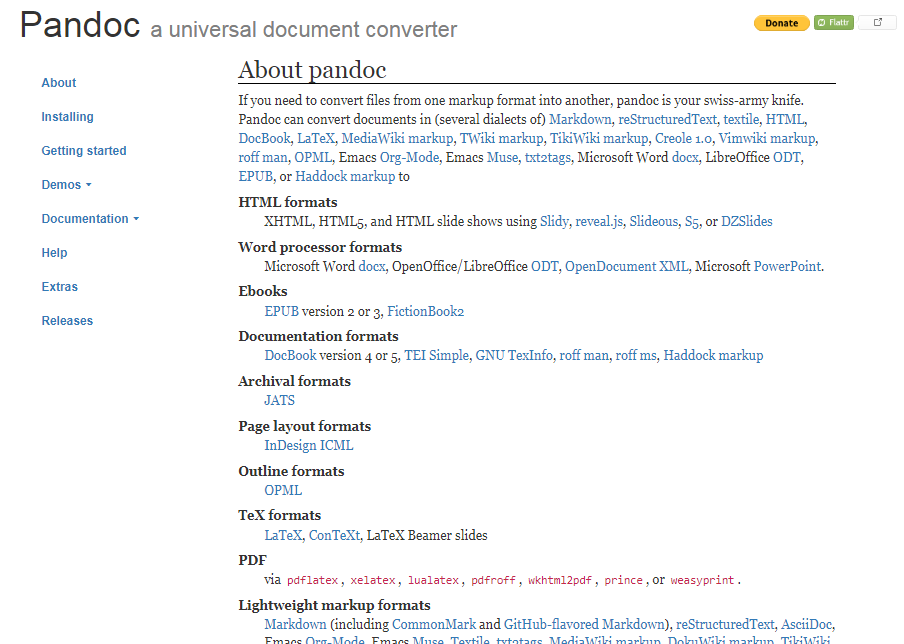
```

---

layout: true

# Rmarkdown

---

```{r echo=FALSE, out.width='70%'}
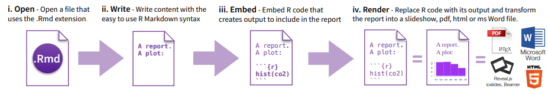
```

## Mix

* Markdown
    - paragraph structure
    - comments
    - links

* R code ("chunks")

* Output of R code

---

## Flow

```{r echo=FALSE, fig.align="center", fig.cap="", out.width='70%'}

```

--

```{r echo=FALSE, fig.align="left", fig.cap="", out.width='10%'}
knitr::include_graphics('img/package-knitr-logo.png')
```
* [knitr](https://yihui.name/knitr/)  


---

layout: true

# Your first Rmarkdown file

---
.student[Who has not been able to install Rmarkdown and Latex ?]

--

```{r echo=FALSE, out.width=c('40%','40%')}
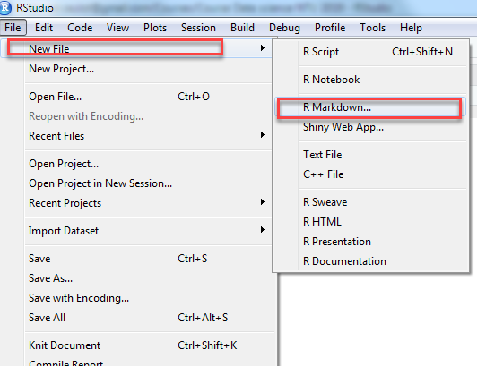
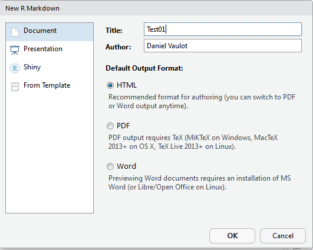
```

---

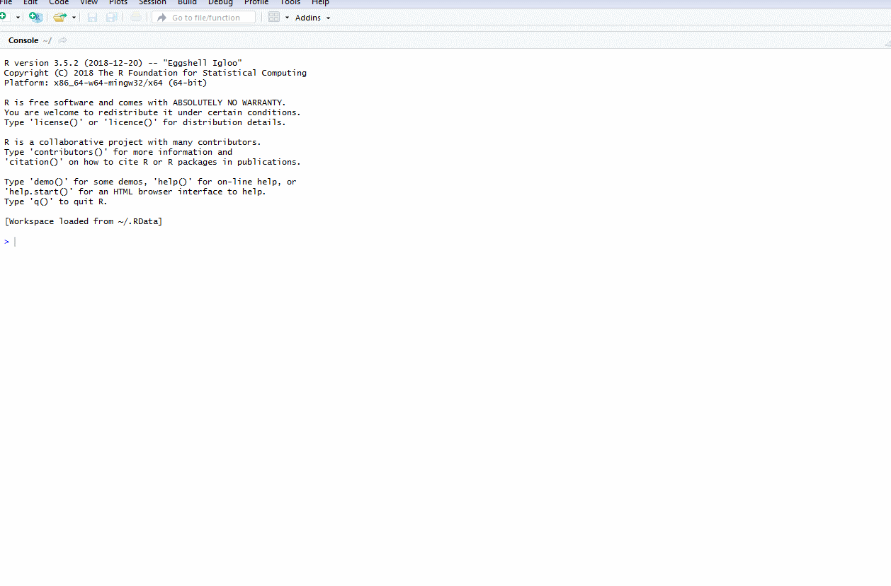

---

## Knit to HTML

```{r echo=FALSE, out.width='80%'}
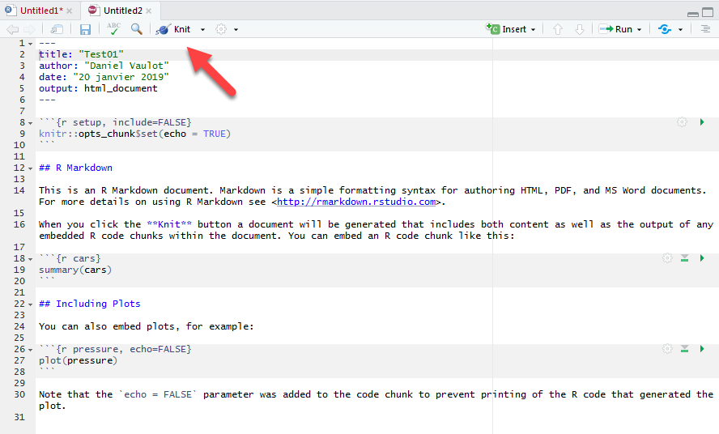
```

.warning[Save to "xxx.Rmd"]

---

```{r echo=FALSE, out.width='100%'}
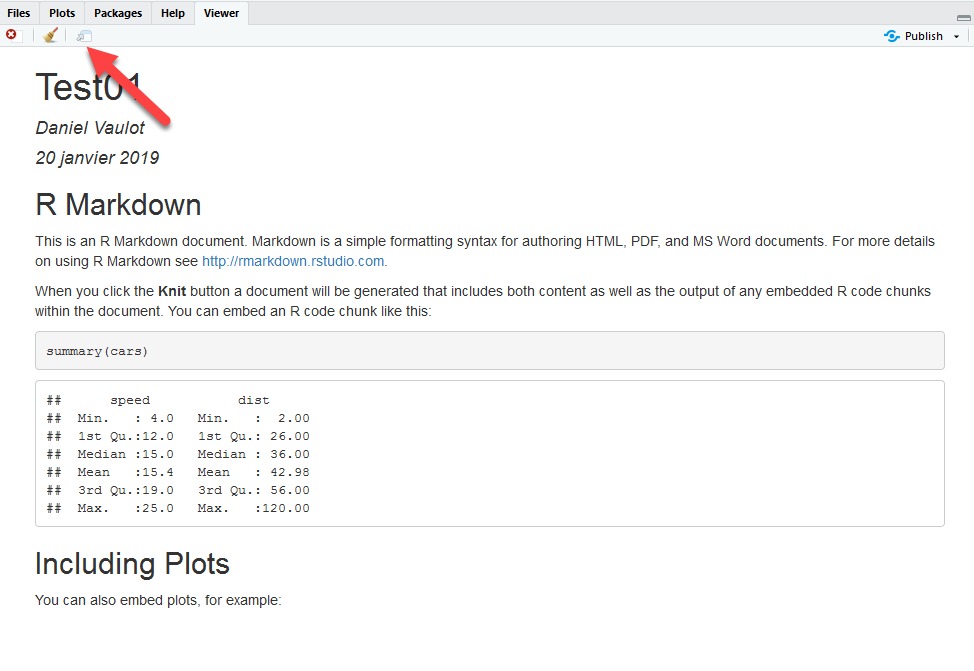
```

---

## Knit of pdf

```{r echo=FALSE, out.width='40%'}
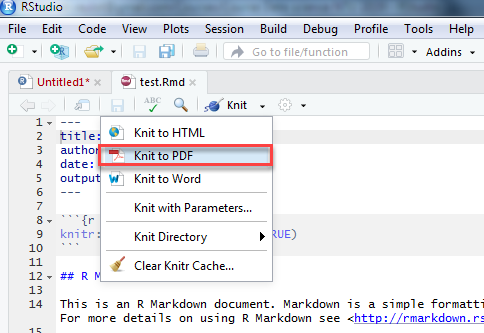
```

---
```{r echo=FALSE, out.width='100%'}
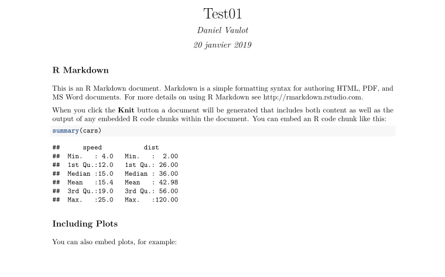
```


---

layout: true

# The Rmarkdown file

---

## File structure

```{r echo=FALSE, out.width='100%'}
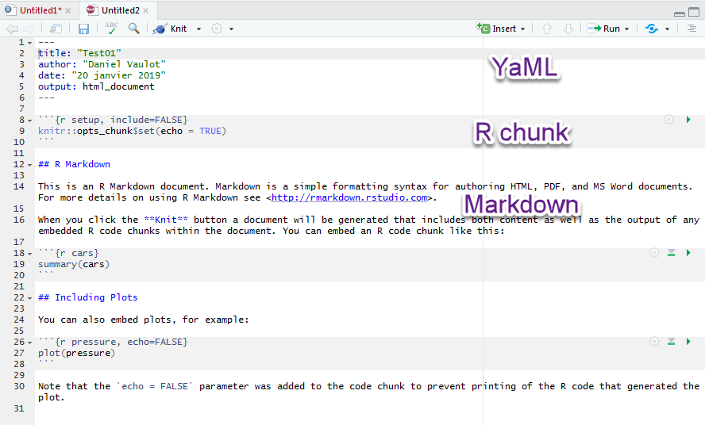
```

---

## Knit process

```{r echo=FALSE, out.width='100%'}
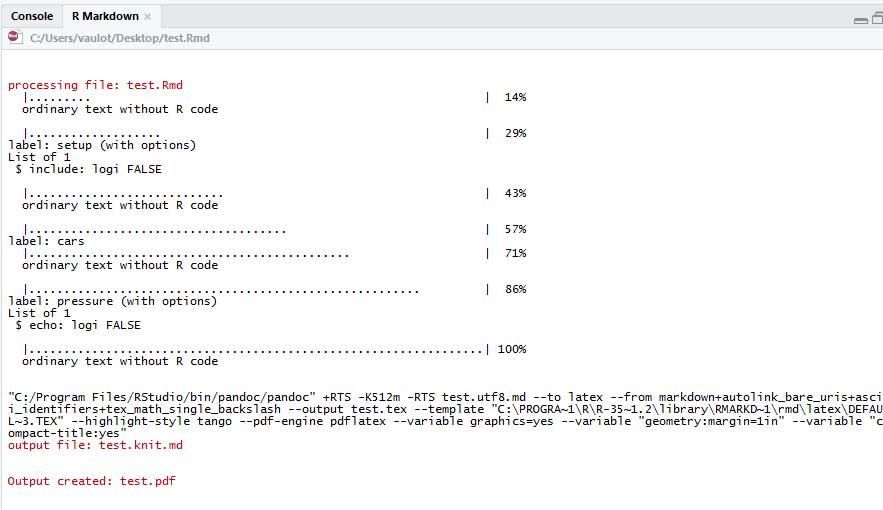
```


---

## Output

```{r echo=FALSE, out.width='100%'}
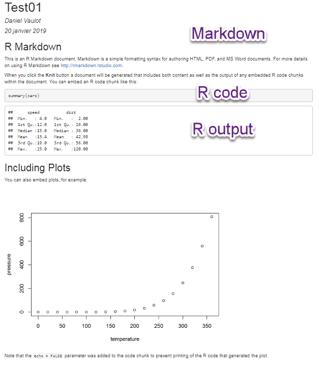
```

---

layout: true

# Chunks

---

## Insert chunk

```{r echo=FALSE, out.width='100%'}
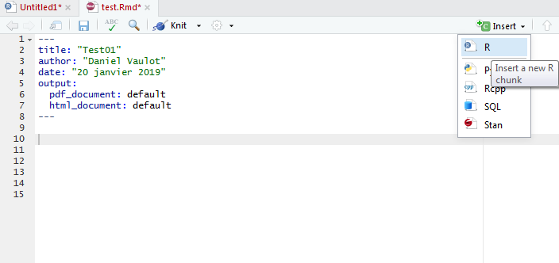
```

---

## Options

```{r echo=FALSE, out.width='100%'}
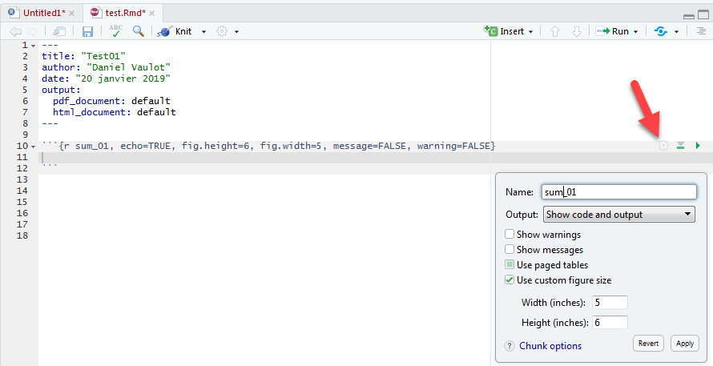
```

---

## Add a code to chunk

```{r echo=FALSE, out.width='100%'}
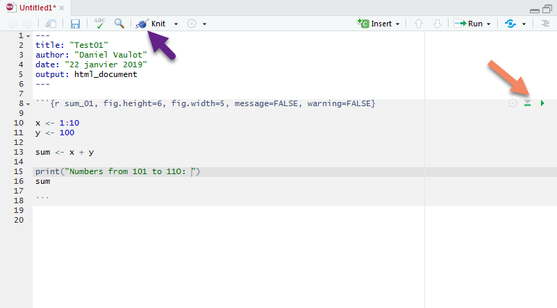
```

---

## Run chunk inside Rmd file

```{r echo=FALSE, out.width='100%'}
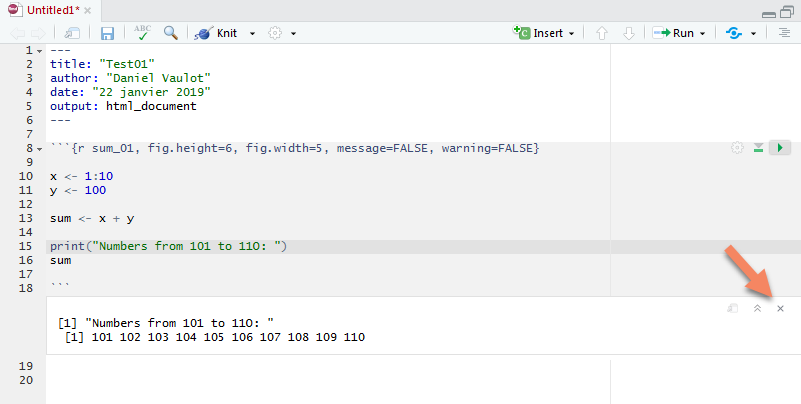
```

---

## Knit chunk to HTML

```{r echo=FALSE, out.width='50%'}
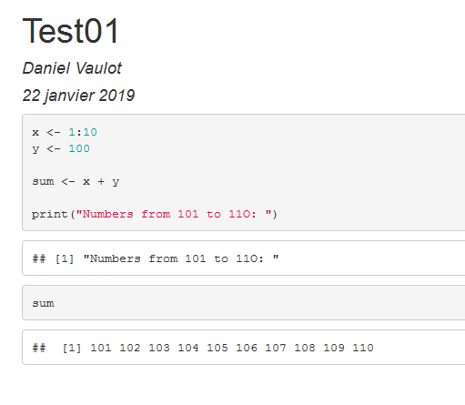
```

---

## Useful options

<br>

Options | Default value | Aim
--- | --- | ---
echo | TRUE | Print code (= FALSE in a report for example)
eval | TRUE | Evaluate code (= FALSE if want to show code only)
warning  | TRUE | Warning message (= FALSE to remove long warnings)
message  | TRUE | Messages (= FALSE to remove long messages)
cache   | FALSE | If TRUE only modified chunks will be evaluated
   |  |  very useful for computing heavy codes
fig.height  |  |  inches
fig.width  |  |  inches

---

## Set defaults options

* Insert in a R chunk at the beginning of your Rmarkdownn file

```{r, eval=FALSE}
  knitr::opts_chunk$set(fig.width=6, fig.height=6, 
                        eval=TRUE, 
                        cache=TRUE,
                        echo=TRUE,)

```


---

layout: true

# What can you do with Rmarkdown ?

---
## Presentation

.left-column[
```{r echo=FALSE, fig.cap="", out.width='45%'}

```

]

.right-column[

https://github.com/yihui/xaringan
 
```{r echo=FALSE, fig.cap="", out.width='80%'}
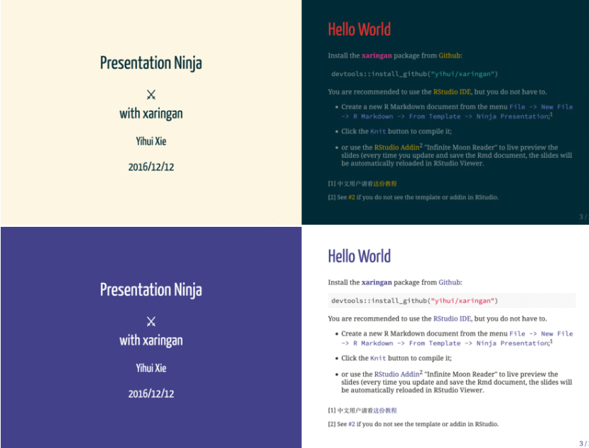
```
]


---
## Posters

.left-column[
```{r echo=FALSE, fig.cap="", out.width='45%'}
knitr::include_graphics('img/package-posterdown-logo.png')
```

]

.right-column[

https://github.com/brentthorne/posterdown
 
```{r echo=FALSE, fig.cap="", out.width='80%'}
knitr::include_graphics('img/package-posterdown-example.png')
```
]

---
## Curriculum vitae

.left-column[
```{r echo=FALSE, fig.cap="", out.width='45%'}
knitr::include_graphics('img/package-vitae-logo.png')
```

]

.right-column[

https://cloud.r-project.org/web/packages/vitae/index.html
 
```{r echo=FALSE, fig.cap="", out.width='90%'}

knitr::include_graphics('img/package-vitae-example-02.png')
```
]
---

## Website

.left-column[
```{r echo=FALSE, fig.cap="", out.width='45%'}

```

]

.right-column[

https://bookdown.org/yihui/blogdown/
 
```{r, out.width="90%", echo=FALSE, fig.align="center"}

```
]

---
layout: false

# Next time: Data manipulation (tidyr)

.pull-left[
What you will learn :

* Read data from files (text, Excel)
* Manipulate data
  - create new columns
  - filter
  - summarize (statistics)
]

.pull-right[

```{r echo=FALSE, fig.align="center", fig.cap="", out.width='40%'}
knitr::include_graphics('img/R_for_datascience.png')
```
]

.student[
* Please install the following packages and their dependencies
    * readr
    * readxl
    * dplyr
    * tidyr
    * stringr
* Download data files (links on slack)

* Chapter 5 of R for data science: https://r4ds.had.co.nz/
]


