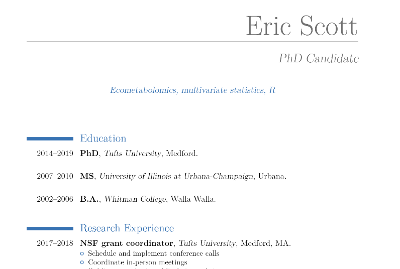
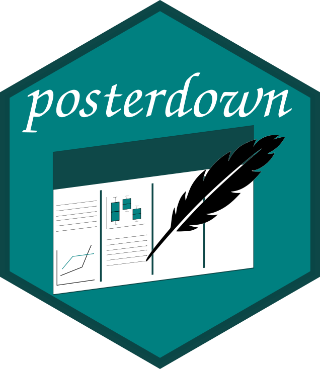
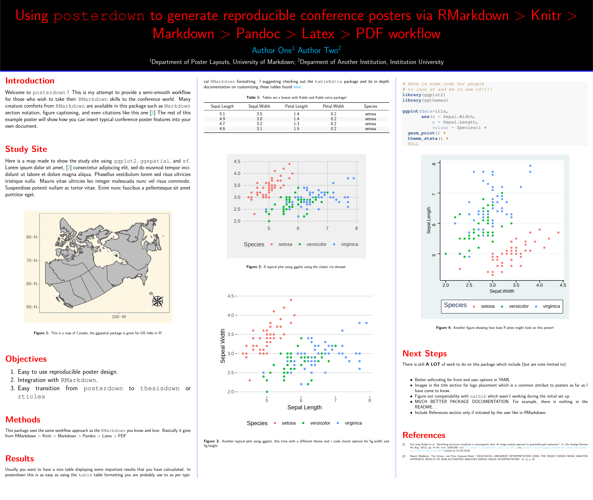

```{r setup, include=FALSE}
library("knitr")
library("kableExtra")

options(htmltools.dir.version = FALSE)
  knitr::opts_chunk$set(fig.width=6, 
                        fig.height=6, 
                        eval=TRUE, 
                        cache=TRUE,
                        echo=TRUE,
                        prompt=FALSE,
                        tidy=TRUE,
                        comment=NA,
                        message=FALSE,
                        warning=TRUE,
                        highlight=TRUE,
                        fig.show='hold')
```

```{r, echo=FALSE}
# Define a function for formatting the dataframes

 my_kable <- function(df){
   options(knitr.kable.NA = '') 
   knitr::kable(df,"latex",row.names =FALSE, booktabs=T, linesep = "") %>%
      kableExtra::kable_styling(latex_options = c("scale_down", "striped"))
   }
```

```{r, echo=FALSE}
# All presentations done with Xaringan
# See Wiki - https://github.com/yihui/xaringan/wiki

# css: [default, metropolis, metropolis-fonts, "metropolis-dv.css"]

# Styles for code highlighting : https://github.com/gnab/remark/wiki/Configuration

# Visualize : https://jmblog.github.io/color-themes-for-google-code-prettify/


```
# Fundamental of Data Science for EESS


```{r, out.width="40%", echo=FALSE, fig.align="center"}
knitr::include_graphics("img/course-logo.png")
```

## R session 02 - R markdown

.font120[**Daniel Vaulot**]

2019-01-24

.pull-left[
```{r, out.width="50%", echo=FALSE, fig.align="left"}
knitr::include_graphics("img/NTU-Logo-full-colour.png")
```
]

.pull-right[
```{r, out.width="50%", echo=FALSE, fig.align="right"}
knitr::include_graphics("img/logo_SBR.png")
```
]

---
layout: true

# Outline

---


.font150[
* What is R and why use R ?
* Resources
* Get started
* What can you do with R markdown ?
]
---
layout: true

# Introduction

---


---
layout: true

# What can you do with Rmarkdown ?

---
## Curriculum vitae

.left-column[
```{r echo=FALSE, fig.cap="", out.width='45%'}
knitr::include_graphics('img/package-vitae-logo.png')
```

]

.right-column[

https://cloud.r-project.org/web/packages/vitae/index.html
 
```{r echo=FALSE, fig.cap="", out.width='90%'}


```
]

---
## Posters

.left-column[
```{r echo=FALSE, fig.cap="", out.width='45%'}

```

]

.right-column[

https://github.com/brentthorne/posterdown
 
```{r echo=FALSE, fig.cap="", out.width='80%'}

```
]