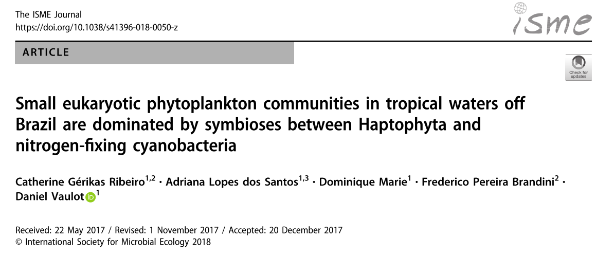
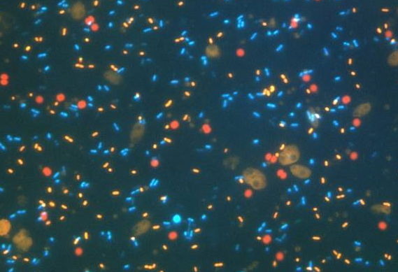
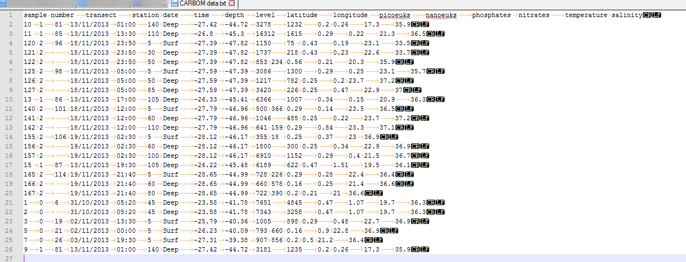
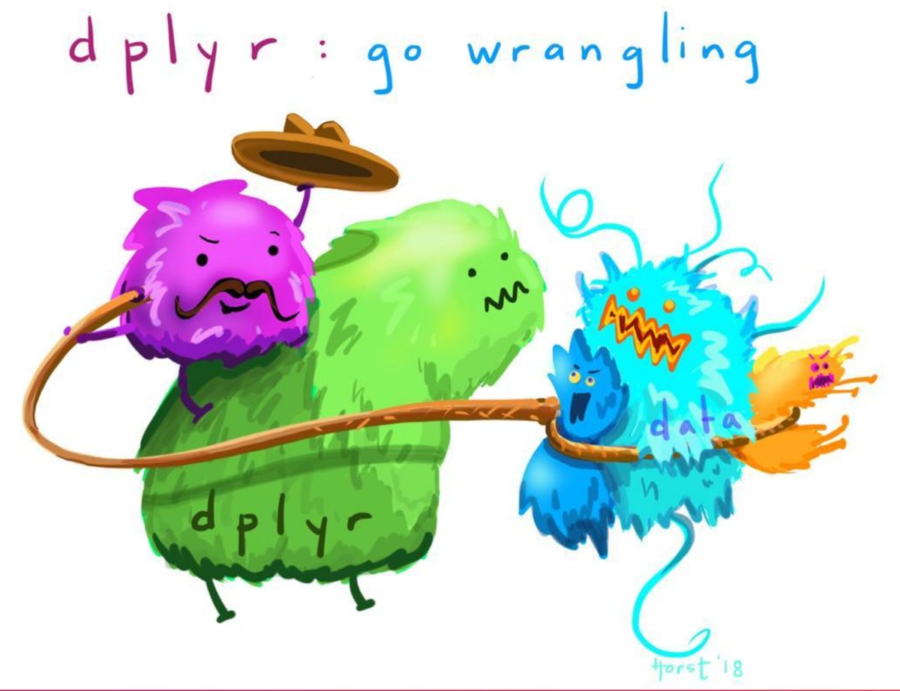

```{r setup, include=FALSE, purl=FALSE}
library("knitr")

options(htmltools.dir.version = FALSE)
  knitr::opts_chunk$set(fig.width=6, 
                        fig.height=6, 
                        eval=TRUE, 
                        cache=FALSE,
                        echo=TRUE,
                        prompt=FALSE,
                        tidy=TRUE,
                        comment=NA,
                        message=FALSE,
                        warning=TRUE,
                        highlight=TRUE,
                        fig.show='hold')
```

```{r, echo=FALSE, purl=FALSE}
# Define a function for formatting the dataframes

 my_kable <- function(df, nrows = 10){
   options(knitr.kable.NA = '') 
   knitr::kable(head(df, nrows),"html",row.names =FALSE, booktabs=T, linesep = "") %>%
      kableExtra::kable_styling(bootstrap_options = c("striped", "hover", "condensed"),font_size = 9 )
   }
```


# Fundamental of Data Science for EESS


```{r, out.width="40%", echo=FALSE, purl=FALSE, fig.align="center"}

```

## R session 03 - Data wrangling

.font120[**Daniel Vaulot**]

2019-01-31

.pull-left[
```{r, out.width="50%", echo=FALSE, purl=FALSE, fig.align="left"}
knitr::include_graphics("img/NTU-Logo-full-colour.png")
```
]

.pull-right[
```{r, out.width="50%", echo=FALSE, purl=FALSE, fig.align="right"}
knitr::include_graphics("img/logo_SBR.png")
```
]

---

class: middle

## Outline


.font150[
* Concept of tidy data
* Reading data
* Manipulating data
    * Columns
    * Rows
    * Joining tables
    * Going from wide to long format
]

---

# Installation and Resources

.pull-left[
## Packages

.font70[
* readxl  : Reading Excel files
* readr   : Reading and writing Text files
* dplyr : Filter and reformat data frames
* tidyr : Make data "tidy"
* stringr :  Manipulating strings
* lubridate : Manipulate date
* unzip `R-session-03.zip`
* Open in R `R-session-03-data_wrangling.R`
]

## Resources
.font70[
* [R for data science](https://r4ds.had.co.nz/): (Chapter 5)

* Cheat sheets
    * [Importing data](https://github.com/rstudio/cheatsheets/raw/master/data-import.pdf)
    * [Cleaning up data](https://github.com/rstudio/cheatsheets/raw/master/data-transformation.pdf)
    * [Manipulating strings](https://github.com/rstudio/cheatsheets/raw/master/strings.pdf)
]
]

.pull-right[

```{r echo=FALSE, purl=FALSE, fig.align="center", fig.cap="", out.width='65%'}
knitr::include_graphics('img/R_for_datascience.png')
```
]

---


# Tidy data


1. Each variable must have its own column.
2. Each observation must have its own row.
2. Each value must have its own cell.

```{r, echo=FALSE, purl=FALSE, fig.cap="", out.width = '100%', fig.align= "center"}
knitr::include_graphics("img/tidy-data.png")
```

---

# Initialize

## Load necessary libraries


```{r libraries, message= FALSE, warning=FALSE}

library("readxl") # Import the data from Excel file
library("readr")  # Import the data from Excel file

library("dplyr")  # filter and reformat data frames
library("tidyr")  # make data tidy

library("stringr") # manipulate strings
library("lubridate") # manipulate date 

library("ggplot2") # graphics
```

---
layout: true

# Oceanographic data

---

## CARBOM cruise off Brazil

.pull-left[
```{r, echo=FALSE, purl=FALSE, fig.cap="", out.width = '100%', fig.align= "center"}
knitr::include_graphics("img/carbom_cruise.png")
```

]

--

.pull-right[

* Stations
* Depth
* Coordinates
* Temperature, Salinity
* Nitrates, Phosphates

```{r, echo=FALSE, purl=FALSE, fig.cap="", out.width = '100%', fig.align= "center"}

```

]

---

## Microbial populations

.pull-left[
```{r, echo=FALSE, purl=FALSE, fig.cap="", out.width = '100%', fig.align= "center"}

```
]

--

.pull-right[
```{r, echo=FALSE, purl=FALSE, fig.cap="", out.width = '80%', fig.align= "center"}
knitr::include_graphics("img/carbom_flow_cytometry.png")
```
]
* Flow cytometry : 
    * pico-eukaryotes
    * nano-eukaryotes
    

---
layout: true

# Read data

---

## Text file - TAB delimited

```{r, echo=FALSE, purl=FALSE, fig.cap="", out.width = '100%', fig.align= "center"}

```

---

## Reading a text file

```{r}
  samples <- readr::read_tsv("data/CARBOM data.txt")
```

--

```{r, echo=FALSE, purl=FALSE}
  my_kable(samples)
```

--

- __readr::read_tsv()__ : read tab delimited files
- __readr::read_csv()__ : read comma delimited files

- __readr::write_tsv()__ : write tab delimited files


---

## Excel sheet

```{r, echo=FALSE, purl=FALSE, fig.cap="", out.width = '100%', fig.align= "center"}
knitr::include_graphics("img/carbom_excel.png")
```

---

## Read the data - read_excel

```{r}
  samples <- readxl::read_excel("data/CARBOM data.xlsx", 
                           sheet = "Samples_boat")
```

--

```{r, echo=FALSE, purl=FALSE}
  my_kable(samples)
```

* Can also select a range : e.g. A1:Q26
* Can skip lines

---

## Bad data input under Excel
<br>

```{r, echo=FALSE, purl=FALSE}
  my_kable(samples) %>% 
  kableExtra::row_spec(c(4:5,7:8) , bold = F, background = "lightyellow")
```

* There are missing values in the column __station__ because only recorded when changed

---

## Filling missing values - fill
```{r}
  samples <- tidyr::fill(samples, station)
```

--

```{r, echo=FALSE, purl=FALSE}
  my_kable(samples)
```

* All missing values have been filled in.

---

layout: false
# dplyr - Manipulate  tables


```{r, echo=FALSE, purl=FALSE, out.width = '75%', fig.align= "center"}

```

@allison_horst

---
layout: true

# Manipulate columns

---

## List columns

```{r}
  colnames(samples)
```

---

## Summarize columns

```{r}
  summary(samples$depth)
```

---

## Select specific columns - select

```{r}
samples_select <- dplyr::select(samples, transect, `sample number`,
                                 station, depth, latitude, longitude, 
                                 picoeuks, nanoeuks)
```

--

```{r, echo=FALSE, purl=FALSE}
  my_kable(samples_select)
```
.warning[
* Column names are not "quoted" (in base R you need to "quote" the column names)
* Better not to put space in column header because then must enclose column name with  \` (back-quote)]

---
## Select a range of columns - select

```{r}
  samples_select <- dplyr::select(samples, transect:nanoeuks)
```

--

```{r, echo=FALSE, purl=FALSE}
  my_kable(samples_select)
```

---


## Unselect columns - select

```{r}
  samples_select <- dplyr::select (samples, -nitrates, -phosphates)
```

--

```{r, echo=FALSE, purl=FALSE}
  my_kable(samples_select)
```

---

## Using the pipe operator - %>% 

```{r}
  samples_select <- samples %>% dplyr::select(transect:nanoeuks)
```

--

```{r, echo=FALSE, purl=FALSE}
  my_kable(samples_select)
```

* It is cleaner to write on 2 lines

```{r, tidy=FALSE}
  samples_select <- samples %>% 
    dplyr::select(transect:nanoeuks)
```

---

## Renaming variables - rename

```{r}
  samples <- samples %>% 
    dplyr::rename(sample_number = `sample number`)
```

--

```{r, echo=FALSE, purl=FALSE}
  my_kable(samples)%>% 
  kableExtra::column_spec(c(1) , background = "lightyellow")
```

---

## Creating new variables - mutate

```{r, tidy=FALSE}
  samples <- samples %>% 
    dplyr::mutate(pico_pct = picoeuks/(picoeuks+nanoeuks)*100)
```

--

```{r, echo=FALSE, purl=FALSE}
  my_kable(samples)%>% 
  kableExtra::column_spec(c(16) , bold = T, background = "lightyellow")
```

* You can also use __transmute()__ but then it will drop all the other columns.
* It is much much better to compute new variables in R than in Excel, because you can easily track and correct errors.

---

## Using the pipe operator you can chain operations

```{r, tidy=FALSE}
  samples_select <- samples  %>% 
    dplyr::select(sample_number:nanoeuks, level) %>% 
    dplyr::mutate(pico_pct = picoeuks/(picoeuks+nanoeuks)*100)
```

--

```{r, echo=FALSE, purl=FALSE}
  my_kable(samples_select)%>% 
  kableExtra::column_spec(c(12) , bold = T, background = "lightyellow")
```

---

## Creating labels with mutate and stringr functions

```{r, tidy=FALSE}
  samples <- samples %>% 
    dplyr::mutate(sample_label = str_c("TR",transect,"St",station, sep="_"))
```

--

```{r, echo=FALSE, purl=FALSE}
  my_kable(select(samples, sample_number:time, sample_label))%>% 
  kableExtra::column_spec(c(6) , bold = T, background = "lightyellow")

  samples <- samples %>% select(-sample_label)
```

---

## Changing type of some columns - mutate

```{r, tidy=FALSE}
  samples <- samples %>% 
    dplyr::mutate(time = str_c(lubridate::hour(time), 
                               lubridate::minute(time), sep=":"))
```

--

```{r, echo=FALSE, purl=FALSE}
  my_kable(samples) %>% 
  kableExtra::column_spec(c(5) , bold = T, background = "lightyellow")
```

* Use the `lubridate` package to manipulate dates

---
layout: true

# Manipulating rows

---
## Order rows - arrange

```{r}
  samples <- samples %>% 
    dplyr::arrange(transect, station)
```

--

```{r, echo=FALSE, purl=FALSE}
  my_kable(samples)%>% 
  kableExtra::column_spec(c(3) , bold = T, background = "lightyellow")
```
* Station 6 is not ordered numerically.  It is because __station__ is a character column.

---

## Order rows - transform to numeric

```{r, tidy=FALSE}
  samples <- samples %>% 
    dplyr::mutate(station = as.numeric(station)) %>% 
    dplyr::arrange(transect, station)
```

--

```{r, echo=FALSE, purl=FALSE}
  my_kable(samples)%>% 
  kableExtra::column_spec(c(3) , bold = T, background = "lightyellow")
```

* One station named "Bloom" could not be converted to numerical (-> NA)

---

## Summarize rows - group_by / summarize

* Group by transect and station
* Compute mean of the percent picoplankton

```{r, tidy=FALSE}
  samples_mean <- samples %>% 
    dplyr::group_by(transect, station) %>% 
    dplyr::summarise(n_samples = n(), 
              mean_pico_percent = mean(pico_pct, na.rm=TRUE))
```

--

```{r, echo=FALSE, purl=FALSE}
  my_kable(samples_mean)%>% 
  kableExtra::column_spec(c(3, 4) , bold = T, background = "lightyellow")
```

---

## Filtering rows - filter

* Get only the surface samples

```{r}
  samples_surf <- samples %>% 
    dplyr::filter(level == "Surf" ) 
```

--

```{r, echo=FALSE, purl=FALSE}
  my_kable(samples_surf)
```

* ! Use the logical operators __==__ != > >= < <= is.na()

---
layout: true

# Joining tables

---

```{r, echo=FALSE, purl=FALSE, fig.cap="", out.width = '60%', fig.align= "center"}
knitr::include_graphics("img/sql_inner_join.png")
```

---

Very often you have tables that contain a common field and that you need to __join__ together. 

--

A common example in oceanography.  After a cruise you have many tables

Tables :
* Stations - Station #, Longitude, Latitude
* Cast (CTD) - Station #, Cast #, Depth, Temp, Sal (continuous)
* Bottles - Cast #, Depth, Bottle #  
* Water samples - Bottle #, Sample #
* Biological samples - Sample #, Analysis #

You want to know the Longitude and Latitude of a given biological sample.

--

Analysis # -> Sample # -> Bottle # -> Cast # -> Station # -> Long, Lat

In order to join 2 tables, they must have a common field. It is called the __KEY__. 

For example it can be Bottle #, Station #


---

## Sequence samples (metabarcoding)

* Each sample has been split into 2 fractions by sorting : pico- and nano
* These separate samples have then been sequenced to determine the composition of the plankton community

--

```{r, echo=FALSE, purl=FALSE, fig.cap="", out.width = '50%', fig.align= "center"}

```

---

## Reading table with sequence samples

```{r, tidy=FALSE}
  sequences <- readxl::read_excel("data/CARBOM data.xlsx", 
                           sheet = "Samples_sequencing") 
```


```{r, echo=FALSE, purl=FALSE}
  my_kable(sequences, 5) %>% 
  kableExtra::column_spec(c(2) , bold = F, background = "lightyellow")
```

--

## Using only a subset of the columns in the sample table


```{r, echo=TRUE, tidy=TRUE}
  samples_select <- samples  %>% 
    dplyr::select(sample_number:longitude)
```

---
* Table sequences
```{r, echo=FALSE, purl=FALSE}
  my_kable(sequences, 5) %>% 
  kableExtra::column_spec(c(2) , bold = F, background = "lightyellow")
```

* Table samples_select

```{r, echo=FALSE, purl=FALSE}
  my_kable(samples_select, 5)%>% 
  kableExtra::column_spec(c(1) , bold = F, background = "lightyellow")
```

* The two tables have a common field called __sample_number__ (KEY).

---

## Joining sequence and sample tables.

```{r}
  sequences_join <- left_join(sequences, samples_select)
```

--

```{r, echo=FALSE, purl=FALSE}
  my_kable(sequences_join) %>% 
  kableExtra::column_spec(c(2) , bold = F, background = "lightyellow")
```

---

## Joining columns with different names

* If the __KEY__ do not have the same name in the two tables it is possible to specify the name of the two columns used for joining.

```{r, tidy=FALSE}
  sequences <- sequences %>% 
    rename(sample_code = sample_number)
```
--

```{r, echo=FALSE, purl=FALSE}
  my_kable(sequences)%>% 
  kableExtra::column_spec(c(2) , bold = F, background = "lightyellow")
```

---

## Joining columns with different names

```{r, tidy=FALSE}
  sequences_join <- left_join(sequences, samples_select, 
                            by= c("sample_code" = "sample_number"))
```

--

```{r, echo=FALSE, purl=FALSE}
  my_kable(sequences_join)%>% 
  kableExtra::column_spec(c(2) , bold = F, background = "lightyellow")
```

---

## Joining with missing data

* Let us remove some samples from the sample table

```{r, tidy=FALSE}
  samples_select <- samples_select %>% 
    filter(sample_number != "10")
```

--

```{r, echo=FALSE, purl=FALSE}
  my_kable(samples_select)
```

---

## Joining with missing data

```{r, tidy=FALSE}
  sequences_join <- left_join(sequences, samples_select, 
                            by= c("sample_code" = "sample_number"))
```

--

```{r, echo=FALSE, purl=FALSE}
  my_kable(sequences_join, 6)
```

.student[
* What happened ?
]

---
layout: true

# Wide vs long tables

---

```{r, echo=FALSE, purl=FALSE, out.width = '70%', fig.align= "center"}

```

@allison_horst

---

## Go from wide to long - gather

```{r, echo=FALSE, purl=FALSE, fig.cap="", out.width = '100%', fig.align= "center"}
knitr::include_graphics("img/gathering.png")

```

* This is very useful for statistical and plotting purposes

---

## Aim

We want to have a column with type of phytoplankton and one column with abundance

```{r, tidy=FALSE}
  samples_select <- samples  %>% 
    dplyr::select(sample_number:nanoeuks)
```


```{r, echo=FALSE, purl=FALSE}
  my_kable(samples_select)%>% 
  kableExtra::column_spec(c(10, 11) , bold = T, background = "lightyellow")
```

---

## Go from wide to long - gather

```{r, tidy=FALSE}
  samples_long <- samples_select  %>% 
    tidyr::gather(key="population", value="cell_ml", picoeuks, nanoeuks)
```
--

```{r, echo=FALSE, purl=FALSE}
  my_kable(samples_long)%>% 
  kableExtra::column_spec(c(10, 11) , bold = T, background = "lightyellow")
```
---

## Go from long to wide - spread

```{r, echo=FALSE, purl=FALSE, fig.cap="", out.width = '80%', fig.align= "center"}
knitr::include_graphics("img/spreading.png")
```

---

## Go from long to wide - spread

```{r, tidy=FALSE}
  samples_wide <- samples_long  %>% 
    tidyr::spread(key="population", value="cell_ml")
```

--

```{r, echo=FALSE, purl=FALSE}
  my_kable(samples_wide)%>% 
  kableExtra::column_spec(c(10, 11) , bold = T, background = "lightyellow")
```

---
layout: false

# Next time: Data visualization (ggplot2)

.pull-left[

## What you will learn :
* Understand the "grammar" of graphics
* Create exploratory graphics
* Finalize graphics for publications
]

.pull-right[

```{r echo=FALSE, purl=FALSE, fig.align="center", fig.cap="", out.width='30%'}
knitr::include_graphics('img/R_for_datascience.png')
```
]

.student[
* Please install the following packages and their dependencies
    * ggplot2
    * cowplot
* Download data files (links on slack)

]

## Reading list
* [Chapter 28 of R for data science](https://r4ds.had.co.nz/graphics-for-communication.html)
* *[Fundamental of data visualization](https://serialmentor.com/dataviz/)*
* *[Data visualization: practical introduction](http://socviz.co/lookatdata.html#what-makes-bad-figures-bad)*


