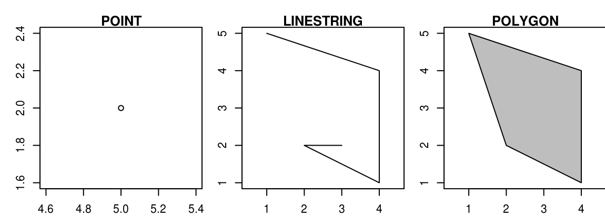
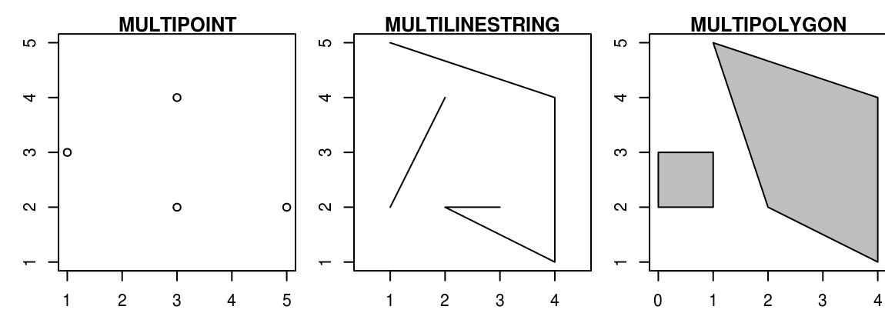
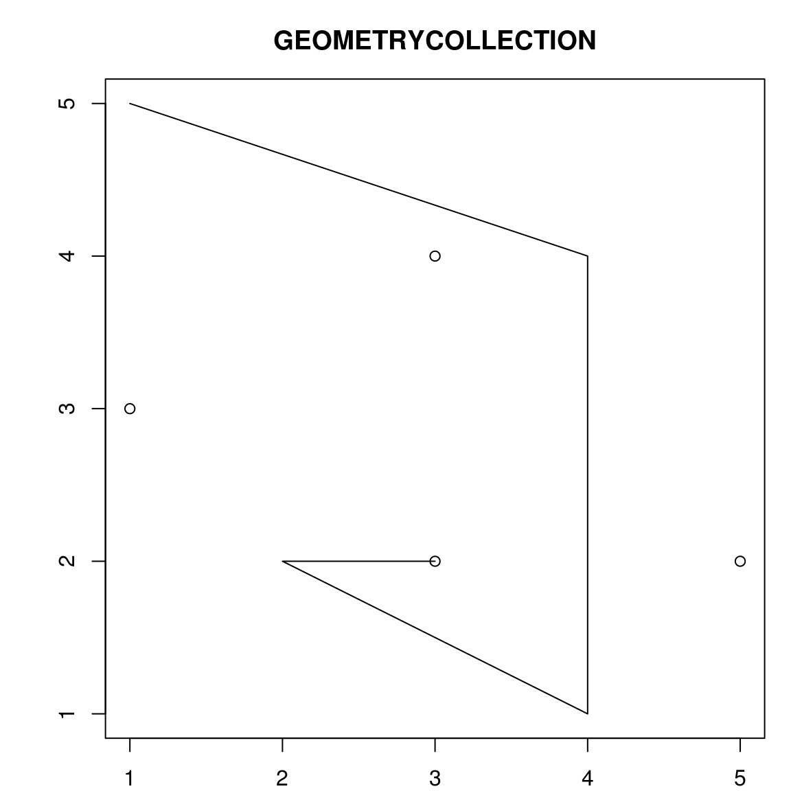
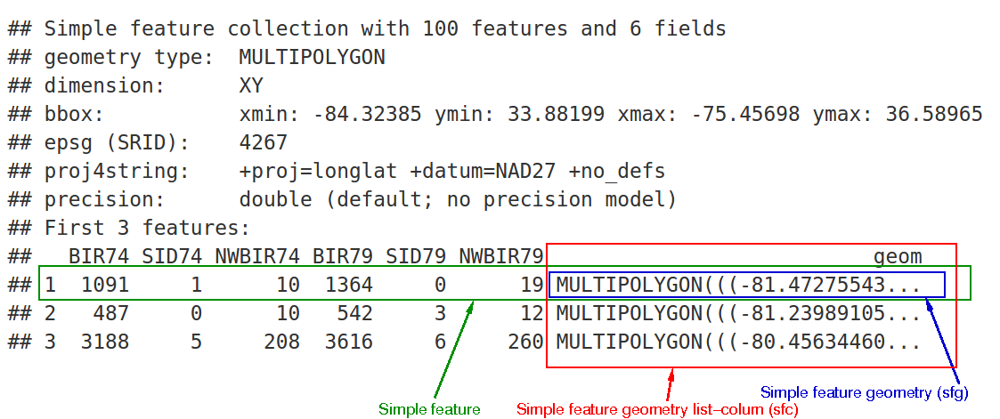
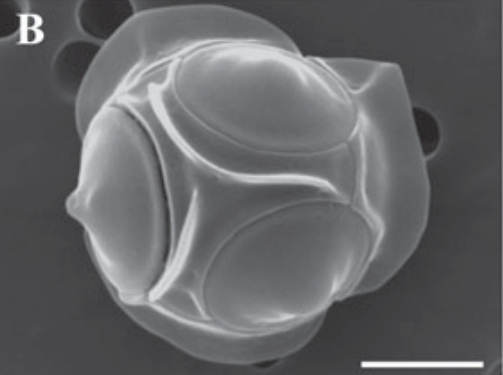
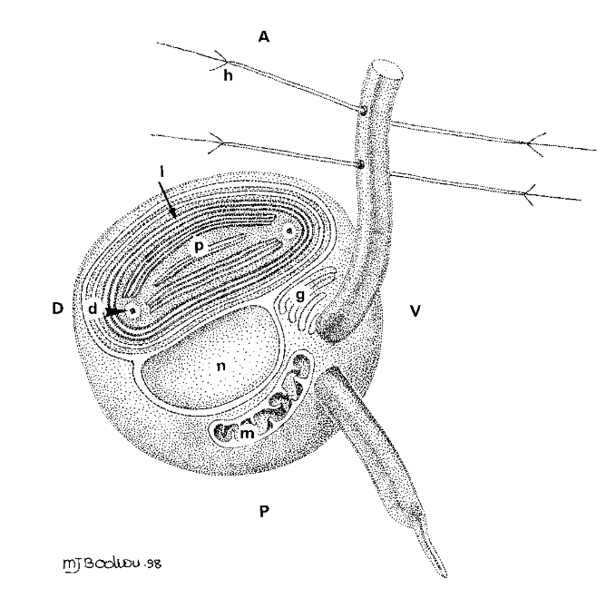
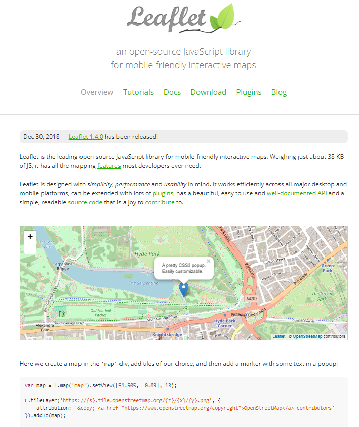
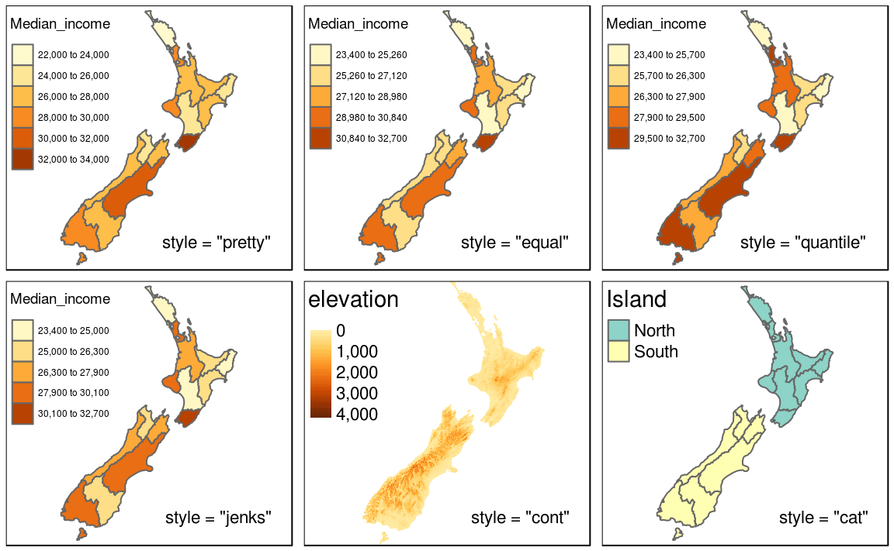
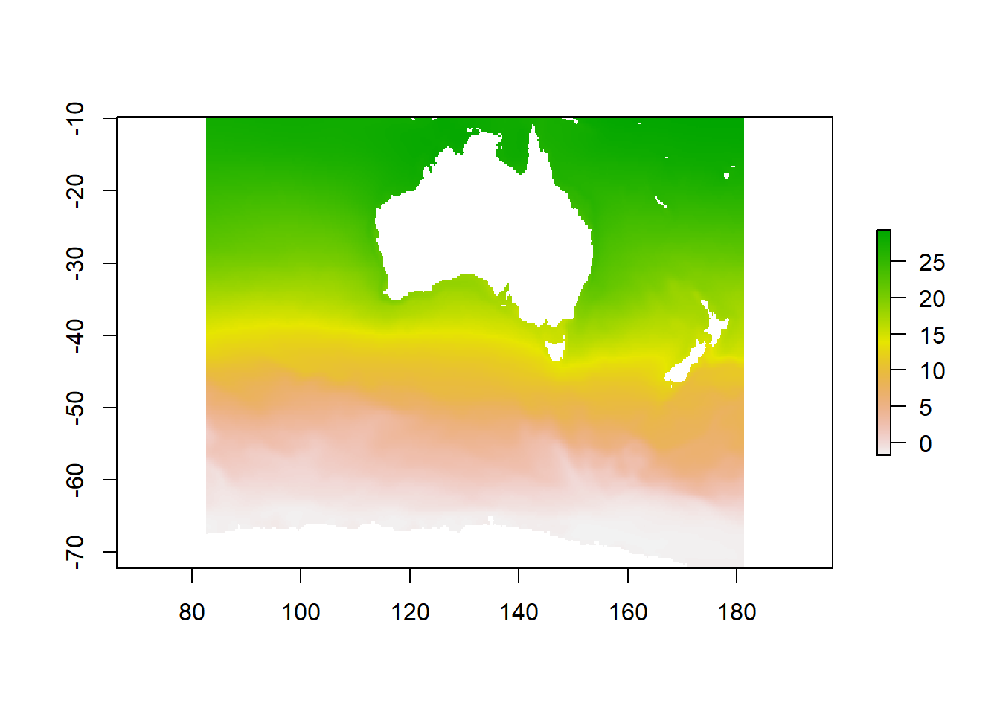

```{r setup, include=FALSE, purl=FALSE}
library("knitr")

options(htmltools.dir.version = FALSE)
  knitr::opts_chunk$set(fig.width=12, 
                        fig.height=12, 
                        eval=TRUE, 
                        cache=FALSE,
                        echo=TRUE,
                        prompt=FALSE,
                        tidy=FALSE,
                        comment=NA,
                        message=FALSE,
                        warning=TRUE,
                        highlight=TRUE,
                        fig.show='hold')
```

```{r, echo=FALSE, purl=FALSE}
# Define a function for formatting the dataframes

 my_kable <- function(df, nrows = 10){
   options(knitr.kable.NA = '') 
   knitr::kable(head(df, nrows),"html",row.names =FALSE, booktabs=T, linesep = "") %>%
      kableExtra::kable_styling(bootstrap_options = c("striped", "hover", "condensed"),font_size = 9 )
   }
```


layout: true
background-image: url(img/course-logo.png)
background-position: right top 30px 
background-size: 45%

# Fundamental of Data Science for EESS


---

<br>
<br>
<br>
<br>

## R session 05 - Mapping

.font120[**Daniel Vaulot**]

2019-03-15

<br>
<br>
<br>
.pull-left[
```{r, out.width="50%", echo=FALSE, fig.align="left", purl=FALSE}
knitr::include_graphics("img/NTU-Logo-full-colour.png")
```
]

.pull-right[
```{r, out.width="50%", echo=FALSE, fig.align="right", purl=FALSE}
knitr::include_graphics("img/logo_SBR.png")
```
]

---
exclude: true

## Resources used
* Simple maps : https://www.r-spatial.org/r/2018/10/25/ggplot2-sf.html

## Other resources
* Global maps : https://github.com/e-cavan/spatial_mapping_R
* Ocean maps: https://www.researchgate.net/profile/Robert_Bauer9/publication/315494507_oceanmap_Mapping_oceanographic_data/links/58d2987292851cd76d346f65/oceanmap-Mapping-oceanographic-data.pdf


---

class: middle

## Outline


.font150[
* Simple features
* Static maps
* Plotting your data
* Interactive maps
]

---

layout: false

# Installation and Resources

.pull-left[

## Packages

### New
* sf
* rnaturalearth
* rnaturalearthdata
* leaflet

### Previously used
* ggplot2
* stringr
* dplyr


]

.pull-right[

```{r echo=FALSE, purl=FALSE, fig.align="center", fig.cap="", out.width='30%'}
knitr::include_graphics('img/R-geocomputation.png')
```

#### Reading list
* [Geocomputation with R - Chapter 2](https://geocompr.robinlovelace.net/spatial-class.html)
* [Geocomputation with R - Chapter 8](https://geocompr.robinlovelace.net/adv-map.html)

#### Other resources
* [Spatial data science](https://keen-swartz-3146c4.netlify.com/index.html)


]

---

# What we want to do...

```{r echo=FALSE, purl=FALSE, fig.align="center", fig.cap="", out.width='70%'}
knitr::include_graphics('img/map-example-swiss.png')
```

---
layout: true

# Simple Features (sf)

---

```{r echo=FALSE, purl=FALSE, fig.align="center", fig.cap="", out.width='60%'}
knitr::include_graphics('img/sf.jpg')
```

* https://github.com/r-spatial/sf

---

* Simple features is an open standard developed and endorsed by the Open Geospatial Consortium (OGC). 
* Simple Features is a hierarchical data model that represents a wide range of geometry types. 

```{r echo=FALSE, purl=FALSE, fig.align="center", fig.cap="", out.width='40%'}
knitr::include_graphics('img/sf-classes.png')
```

---

* A **point** is simply a coordinate in 2D (can be also 3D or 4D space)
    * POINT (5 2)

* A **linestring** is a sequence of points with a straight line connecting the points
    * LINESTRING (1 5, 4 4, 4 1, 2 2, 3 2)

* A **polygon** is a sequence of points that form a closed, non-intersecting ring. 
    * POLYGON (1 5, 2 2, 4 1, 4 4, 1 5)

```{r echo=FALSE, purl=FALSE, fig.align="center", fig.cap="", out.width='60%'}

```

---

  * MULTIPOINT (5 2, 1 3, 3 4, 3 2)
  * MULTILINESTRING ((1 5, 4 4, 4 1, 2 2, 3 2), (1 2, 2 4))
  * MULTIPOLYGON (((1 5, 2 2, 4 1, 4 4, 1 5), (0 2, 1 2, 1 3, 0 3, 0 2)))

```{r echo=FALSE, purl=FALSE, fig.align="center", fig.cap="", out.width='60%'}

```

---

* A **geometry collection** can contain any combination of geometries including (multi)points and linestrings
    * GEOMETRYCOLLECTION (MULTIPOINT (5 2, 1 3, 3 4, 3 2), LINESTRING (1 5, 4 4, 4 1, 2 2, 3 2))

```{r echo=FALSE, purl=FALSE, fig.align="center", fig.cap="", out.width='40%'}

```


---

* Simple feature objects in R are stored in a data frame
* Geographic data occupying a special column, usually named `geom` or `geometry`. 

```{r echo=FALSE, purl=FALSE, fig.align="center", fig.cap="", out.width='60%'}

```

Three classes of sf objects
* **sfg** : geometry
* **sfc** : column - set of geometry plus coordinates system
* **sf** : information about each geometry

---

## sf geometry (sfg) class


```{r, message=TRUE}
library(sf)
```

--
* Creating a point from a vector
```{r, message=TRUE}
sf::st_point(c(5, 2))
```

--
* For line, we need to create a **matrix** with rbind
```{r, message=TRUE}
multipoint_matrix = rbind(c(5, 2), c(1, 3), c(3, 4), c(3, 2))
st_multipoint(multipoint_matrix)
```

---

## sf geometry (sfg) class

* For multiline, we need to create a **list of matrices**
```{r, message=TRUE}
multilinestring_list = list(rbind(c(1, 5), c(4, 4), c(4, 1), c(2, 2), c(3, 2)), 
                            rbind(c(1, 2), c(2, 4)))
st_multilinestring((multilinestring_list))
```

--
* Idem for geometry collection
```{r, message=TRUE}
geometrycollection_list = list(sf::st_multipoint(multipoint_matrix),
                              sf::st_multilinestring(multilinestring_list))
st_geometrycollection(geometrycollection_list)
```

---

## sf column (sfc) class

List of sfg obkects that also contains also information about the coordinate system

```{r, message=TRUE}
point1 = st_point(c(5, 2))
point2 = st_point(c(1, 3))
points_sfc = st_sfc(point1, point2)
points_sfc
```

---

## sf column (sfc) class

Now add Coordinate Reference System (crs)

```{r, message=TRUE}
st_sfc(point1, point2, crs = 4326)
```

---

## sf class

Add some information about the geometry.

```{r, message=TRUE}
lnd_point = st_point(c(0.1, 51.5))                 # sfg object
lnd_geom = st_sfc(lnd_point, crs = 4326)           # sfc object
lnd_attrib = data.frame(                           # data.frame object
  name = "London",
  temperature = 25,
  date = as.Date("2017-06-21")
  )
st_sf(lnd_attrib, geometry = lnd_geom)
```

---
layout: true

# Static maps

---

## Load necessary libraries


```{r libraries, message= FALSE, warning=FALSE}

library("readxl") # Import the data from Excel file
library("dplyr")  # filter and reformat data frames

library("ggplot2") # graphics
library("sf") # simple features
library("rnaturalearth") 
library("rnaturalearthdata")

```

---

## Read the world map data

* `scale` can be 'small', 'medium', 'large'
* `returnclass` can be 'sp' or 'sf' - sf (simple features) is an evolution of sp


```{r}
world <- rnaturalearth::ne_countries(scale = "medium", returnclass = "sf")
```

---

The world data are returned as a sf (simple feature) dataframe which contains
* normal fields
* one field called geometry which contains points, lines or polygon coordinate information

```{r}
colnames(world)
```

---

* The field `name` contains the name of the countries, `continent` the continent, etc...
* The field `geometry` contains the country outline
```{r, purl=FALSE, echo=FALSE}
my_kable(dplyr::select(world, name, continent, geometry), nrow=1)

```
--


```{r}
world$geometry[1]
```

---

## A simple world map

.left-code[
* Use `geom_sf`
```{r map01, eval=FALSE, purl=FALSE, warning=FALSE}
# Set the black and white theme
theme_set(theme_bw())

ggplot(data = world) +
    geom_sf() 
```
]

.right-plot[
```{r, ref.label="map01", echo=FALSE, purl=TRUE, warning=FALSE, out.width = '80%', fig.align= "center"}

```
]

---

## A simple world map

.left-code[
* Use `coord_sf(expand = FALSE)`to have the axis labels 
```{r map01b, eval=FALSE, purl=FALSE, warning=FALSE}

ggplot(data = world) +
    geom_sf() +
    coord_sf(expand = FALSE)
```
]

.right-plot[
```{r, ref.label="map01b", echo=FALSE, purl=TRUE, warning=FALSE, out.width = '80%', fig.align= "center"}

```
]

---

## Color continents

.left-code[
* Add `color="white", fill="blue"`
```{r map02, eval=FALSE, purl=FALSE, warning=FALSE}
ggplot(data = world) +
    geom_sf(color="white", fill="blue")+
    coord_sf(expand = FALSE) 
```
]

.right-plot[
```{r, ref.label="map02", echo=FALSE, purl=TRUE, warning=FALSE, out.width = '80%', fig.align= "center"}

```
]

---
## Plot population

.left-code[
* Use value of column `pop_est`
```{r map03, eval=FALSE, purl=FALSE, warning=FALSE}
ggplot(data = world) +
    geom_sf(aes(fill= pop_est))+
    coord_sf(expand = FALSE)
```
]

.right-plot[
```{r, ref.label="map03", echo=FALSE, purl=TRUE, warning=FALSE, out.width = '80%', fig.align= "center"}

```
]

---
## Plot population

.left-code[
* Change color scale
* Transform the data
```{r map04, eval=FALSE, purl=FALSE, warning=FALSE}
ggplot(data = world) +
    geom_sf(aes(fill= pop_est)) +
    coord_sf(expand = FALSE) +
    scale_fill_viridis_c(trans = "log10")
```
]

.right-plot[
```{r, ref.label="map04", echo=FALSE, purl=TRUE, warning=FALSE, out.width = '80%', fig.align= "center"}

```
]

---
## Modify projections
.left-code[
* Specify coordinate system: https://geocompr.robinlovelace.net/spatial-class.html#crs-intro

    * Lambert projection
    * From the North Pole
    * "+proj=laea +lat_0=90 +lon_0=0 "
```{r map05, eval=FALSE, purl=FALSE, warning=FALSE}
ggplot(data = world) +
    geom_sf() +
    coord_sf(expand = FALSE,
             crs = "+proj=laea +lat_0=90 +lon_0=0 ")
```
]

.right-plot[
```{r, ref.label="map05", echo=FALSE, purl=TRUE, warning=FALSE, out.width = '70%', fig.align= "center"}

```
]

---
## Zoom
.left-code[
* Centered on Singapore
```{r map06, eval=FALSE, purl=FALSE, warning=FALSE}
ggplot(data = world) +
    geom_sf() +
    coord_sf(xlim=c(90,110), 
             ylim=c(-10,10))
```
.warning[Resolution is not optimal]
]

.right-plot[
```{r, ref.label="map06", echo=FALSE, purl=TRUE, warning=FALSE, out.width = '70%', fig.align= "center"}

```
]

---
## Add country names

* Must first define coordinates centroid of each country (X and Y)

```{r, warning=FALSE}
world_centroids<- st_coordinates(st_centroid(world$geometry))
```
--
* Bind the 2 tables
```{r, warning=FALSE}
world_centroids <- cbind(world, world_centroids)
```

```{r, warning=FALSE, echo=FALSE}
my_kable(select(world_centroids, name, X, Y, -geometry), 1)

```

---
## Add country names

.left-code[
* Use `geom_text()`

```{r map07, eval=FALSE, purl=FALSE, warning=FALSE}
ggplot(data = world_centroids) +
    geom_sf() +
    coord_sf(xlim=c(70,130), 
             ylim=c(-20,20)) +
    geom_text(aes(x = X, y=Y, label=name), 
              size=5) +
    xlab("Longitude") +
    ylab("Latitude")
```
]

.right-plot[
```{r, ref.label="map07", echo=FALSE, purl=TRUE, warning=FALSE, out.width = '80%', fig.align= "center"}

```
]


---
layout: true

# Plot data

---

## Read the data

```{r}
bolido <- readxl::read_excel("data/bolido.xlsx")
```


```{r, echo=FALSE, purl=FALSE}
  my_kable(bolido)
```

---

## A bit of biology... Bolidophyceae and Parmales

.pull-left[
### _Triparma_
```{r, out.width="70%", fig.align="center", echo=FALSE, purl=FALSE}

```
* Covered with silica
]

.pull-right[
### _Bolidomonas_
```{r, out.width="50%", fig.align="center", echo=FALSE, purl=FALSE}

```
* 1.5 µm
]


.footnote[_Guillou, L., Chrétiennot-Dinet, M.-J., Medlin, L.K., Claustre, H., Loiseaux-de Goër, S. & Vaulot, D. 1999. J. Phycol. 35:368–81.  
Ichinomiya, M., Yoshikawa, S., Kamiya, M., Ohki, K., Takaichi, S. & Kuwata, A. 2011. J. Phycol. 47:144–51.  
Ichinomiya, M., dos Santos, A.L., Gourvil, P., Yoshikawa, S., Kamiya, M., Ohki, K., Audic, S. et al. 2016. ISME J. 10:2419–34._
]

---

## Plot the stations where Bolidophyceae found

.left-code[
* Filter by to remove stations where Bolido are not present
```{r map08, eval=FALSE, purl=FALSE, warning=FALSE}
ggplot(data = world) +
    geom_sf()+
    coord_sf(expand = FALSE) +
    geom_point(data=filter(bolido, 
                           bolido_pct >0), 
               aes(x=longitude, 
                   y=latitude), 
               size=3)
```
]

.right-plot[
```{r, ref.label="map08", echo=FALSE, purl=TRUE, warning=FALSE, out.width = '90%', fig.align= "center"}

```
]

---

## Percentage of Bolidophyceae

.left-code[
* Filter by to remove stations where Bolido are not present
```{r map09, eval=FALSE, purl=FALSE, warning=FALSE}
ggplot(data = world) +
    geom_sf()+
    coord_sf(expand = FALSE) +
    geom_point(data=filter(bolido, 
                           bolido_pct >0), 
               aes(x=longitude, 
                   y=latitude, 
                   size=bolido_pct),
               color="blue")
```
]

.right-plot[
```{r, ref.label="map09", echo=FALSE, purl=TRUE, warning=FALSE, out.width = '90%', fig.align= "center"}

```
]

---

## Dominant species of _Triparma_

.left-code[
* Color with species
* Put species legend at bottom on 2 rows

```{r map10, eval=FALSE, purl=FALSE, warning=FALSE}
ggplot(data = world) +
    geom_sf()+
    coord_sf(expand = FALSE) +
    geom_point(data=filter(bolido, 
                           bolido_pct >0,
                           stringr::str_detect(species_dominant, "Triparma")), 
               aes(x=longitude, 
                   y=latitude,
                   color=species_dominant),
               size = 4) +
   scale_colour_viridis_d() +
   theme(legend.position="bottom") +
   guides(color=guide_legend(nrow=2,
                             byrow=TRUE))
```

]

.right-plot[
```{r, ref.label="map10", echo=FALSE, purl=TRUE, warning=FALSE, out.width = '90%', fig.align= "center"}

```
]

---

layout: true

# Interactive maps

---

## Leaflet

.pull-left[
* Javascript: https://leafletjs.com/
* Leaflet for R : https://rstudio.github.io/leaflet/
* All functions from `leaflet` package

```{r}
library("leaflet") 
```
]

.pull-right[
```{r echo=FALSE, purl=FALSE, fig.align="center", fig.cap="", out.width='80%'}

```
]


---

## Create an empty map

.left-code[

```{r map11, eval=FALSE, purl=FALSE, warning=FALSE}
leaflet(width = 750, height = 500)
```

]

.right-plot[
```{r, ref.label="map11", echo=FALSE, purl=TRUE, warning=FALSE, out.width = '70%', fig.align= "center"}

```
]

---

## Add background (tiles)


.left-code[
 
```{r map12, eval=FALSE, purl=FALSE, warning=FALSE}
leaflet(width = 750, height = 500)%>%
  addTiles()
```

]

.right-plot[
```{r, ref.label="map12", echo=FALSE, purl=TRUE, warning=FALSE, out.width = '70%', fig.align= "center"}

```
]

---

## Set limits and zoom


.left-code[

```{r map13, eval=FALSE, purl=FALSE, warning=FALSE}
leaflet(width = 750, height = 500)%>%
  addTiles() %>%
  setView(lng=0, lat=0, zoom=2)
```

]

.right-plot[
```{r, ref.label="map13", echo=FALSE, purl=TRUE, warning=FALSE, out.width = '70%', fig.align= "center"}

```
]

---

## Adding data points


.left-code[
 
```{r map14, eval=FALSE, purl=FALSE, warning=FALSE}
leaflet(width = 750, height = 500)%>%
  addTiles() %>%
  setView(lng=0, lat=0, zoom=2) %>% 
  addCircleMarkers(data = bolido, 
                   lat = ~ latitude, 
                   lng = ~ longitude,
               radius = 5,
         label = ~ station_id,
         labelOptions = labelOptions(textsize = "10px", 
                                     noHide = T),
         clusterOptions = markerClusterOptions())
```

]

.right-plot[
```{r, ref.label="map14", echo=FALSE, purl=TRUE, warning=FALSE, out.width = '70%', fig.align= "center"}

```
]


---

## Adding background


.left-code[

```{r map15, eval=FALSE, purl=FALSE, warning=FALSE}
leaflet(width = 750, height = 500)%>%
  addTiles() %>%
  setView(lng=0, lat=0, zoom=2) %>% 
  addCircleMarkers(data = bolido, 
                   lat = ~ latitude, 
                   lng = ~ longitude,
               radius = 5,
         label = ~ station_id,
         labelOptions = labelOptions(textsize = "10px", noHide = T),
         clusterOptions = markerClusterOptions()) %>% 
  addProviderTiles(providers$Esri.OceanBasemap)
```
* https://leaflet-extras.github.io/leaflet-providers/preview/

]

.right-plot[
```{r, ref.label="map15", echo=FALSE, purl=TRUE, warning=FALSE, out.width = '80%', fig.align= "center"}

```
]

---

layout: true

# Other packages

---
## Thematic maps (tmap)

* https://cran.r-project.org/web/packages/tmap/vignettes/tmap-getstarted.html

```{r echo=FALSE, purl=FALSE, fig.align="center", fig.cap="", out.width='60%'}

```

---

## Raster

* https://cran.r-project.org/web/packages/raster/vignettes/Raster.pdf


```{r echo=FALSE, purl=FALSE, fig.align="center", fig.cap="", out.width='60%'}

```


---

layout: true
background-image: url(img/course-logo.png)
background-position: right top 30px 
background-size: 45%

# Next time: Your choice ?

---

.font150[

* Strings and date manipulation
* Text mining
* Web mining
* Create your own package
* Intro to databases

]

---
layout: true

# Your turn

---

.left-code[

* Use four shapes files
    * world
    * world_centroids
    * bathymetry 0 m 
    * bathymetry 200 m
    
* https://www.naturalearthdata.com/downloads/10m-physical-vectors/10m-bathymetry/
* Files can be read with  `sf::read_sf`

* Small trick: must use the Windows file convention (\ and not /) and then must escape it !!!

```{r, purl=FALSE, eval=FALSE}
bathy_0 <- read_sf("data\\ne_10m_bathymetry_L_0.shp")
bathy_200 <- read_sf("data\\ne_10m_bathymetry_K_200.shp")
```

]
.right-plot[

```{r echo=FALSE, purl=FALSE, fig.align="center", fig.cap="", out.width='80%'}

# Very tricky must use the Windows file name !!!
bathy_0 <- read_sf("data\\ne_10m_bathymetry_L_0.shp")
bathy_200 <- read_sf("data\\ne_10m_bathymetry_K_200.shp")

theme_set(theme_bw())

ggplot() +
    geom_sf(data = world, fill="grey90", color="grey90") +
    geom_sf(data = bathy_0, fill="deepskyblue", color="deepskyblue") +
    geom_sf(data=bathy_200, fill="white", color="white")+
    coord_sf(xlim=c(-20,40), 
             ylim=c(30,70)) +
    geom_point(data=filter(bolido, 
                           bolido_pct >0), 
               aes(x=longitude, 
                   y=latitude, 
                   size=bolido_pct),
               color="red")+
    geom_text(data = world_centroids, aes(x = X, y=Y, label=name), 
              size=3) +
    xlab("Longitude") + ylab("Latitude") + labs(size = "Bolido %")
  
```
]

---

```{r eval=FALSE, purl=FALSE}

# Very tricky must use the Windows file convention (backslash and not slash) !!!
bathy_0 <- read_sf("data\\ne_10m_bathymetry_L_0.shp")
bathy_200 <- read_sf("data\\ne_10m_bathymetry_K_200.shp")

theme_set(theme_bw())

ggplot() +
    geom_sf(data = world, fill="grey90", color="grey90") +
    geom_sf(data = bathy_0, fill="deepskyblue", color="deepskyblue") +
    geom_sf(data=bathy_200, fill="white", color="white")+
    coord_sf(xlim=c(-20,40), 
             ylim=c(30,70)) +
    geom_point(data=filter(bolido, 
                           bolido_pct >0), 
               aes(x=longitude, 
                   y=latitude, 
                   size=bolido_pct),
               color="red")+
    geom_text(data = world_centroids, aes(x = X, y=Y, label=name), 
              size=3) +
    xlab("Longitude") + ylab("Latitude") + labs(size = "Bolido %")
  
```