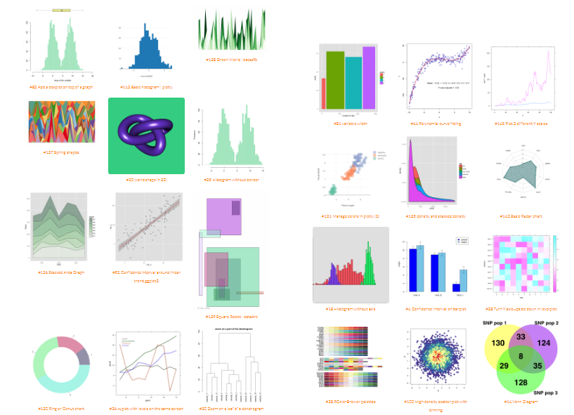
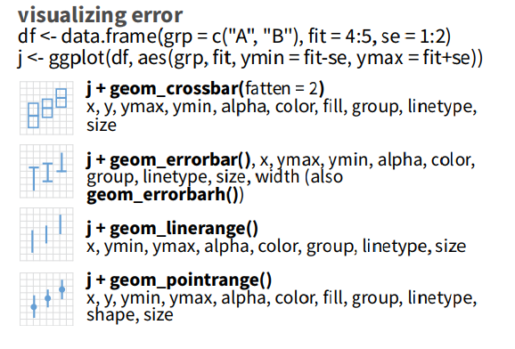
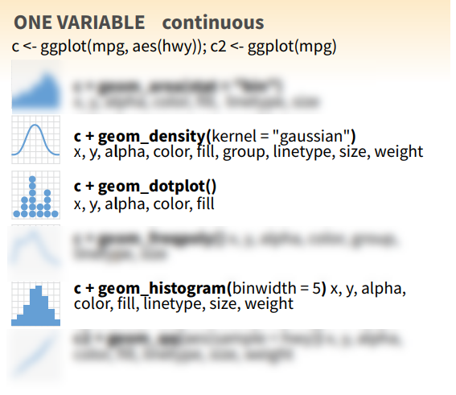
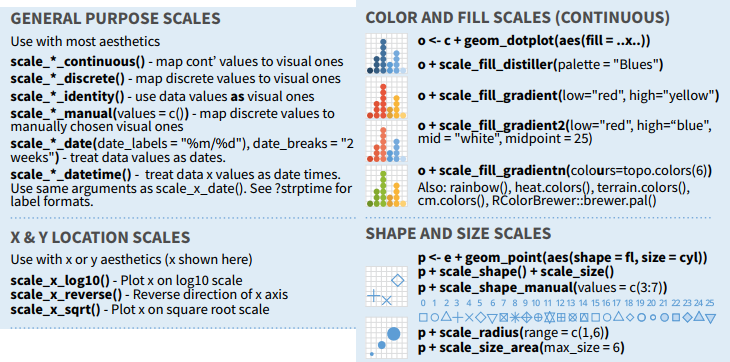

```{r setup, include=FALSE, purl=FALSE}
library("knitr")

options(htmltools.dir.version = FALSE)
  knitr::opts_chunk$set(fig.width=6, 
                        fig.height=6, 
                        eval=TRUE, 
                        cache=FALSE,
                        echo=TRUE,
                        prompt=FALSE,
                        tidy=FALSE,
                        comment=NA,
                        message=FALSE,
                        warning=TRUE,
                        highlight=TRUE,
                        fig.show='hold')
```

```{r, echo=FALSE, purl=FALSE}
# Define a function for formatting the dataframes

 my_kable <- function(df, nrows = 10){
   options(knitr.kable.NA = '') 
   knitr::kable(head(df, nrows),"html",row.names =FALSE, booktabs=T, linesep = "") %>%
      kableExtra::kable_styling(bootstrap_options = c("striped", "hover", "condensed"),font_size = 9 )
   }
```


layout: true
background-image: url(img/course-logo.png)
background-position: right top 30px 
background-size: 45%

# Fundamental of Data Science for EESS


---

<br>
<br>
<br>
<br>

## R session 05 - Mapping

.font120[**Daniel Vaulot**]

2019-03-015

<br>
<br>
<br>
.pull-left[
```{r, out.width="50%", echo=FALSE, fig.align="left", purl=FALSE}
knitr::include_graphics("img/NTU-Logo-full-colour.png")
```
]

.pull-right[
```{r, out.width="50%", echo=FALSE, fig.align="right", purl=FALSE}
knitr::include_graphics("img/logo_SBR.png")
```
]

---
exclude: true

## Resources used
* Global maps : https://github.com/e-cavan/spatial_mapping_R
* Ocean maps: https://www.researchgate.net/profile/Robert_Bauer9/publication/315494507_oceanmap_Mapping_oceanographic_data/links/58d2987292851cd76d346f65/oceanmap-Mapping-oceanographic-data.pdf


---

class: middle

## Outline


.font150[
* Graph types
* Grammar of graphics
* Playing with ggplot2
* Multiple graphs
* ggplot2 syntax
* Your turn
]

---
layout: false
# Installation and Resources

.pull-left[
## Packages

* ggplot2
* cowplot

## Download

* R-session-04.zip

## Resources
* [Chapter 28 of R for data science](https://r4ds.had.co.nz/graphics-for-communication.html)
* [Fundamental of data visualization](https://serialmentor.com/dataviz/)
* [Data visualization: practical introduction](http://socviz.co/lookatdata.html#what-makes-bad-figures-bad)
]

.pull-right[

```{r echo=FALSE, purl=FALSE, fig.align="center", fig.cap="", out.width='60%'}
knitr::include_graphics('img/R_for_datascience.png')
```
]

---

# Data vizualization


```{r echo=FALSE, purl=FALSE, fig.align="center", fig.cap="", out.width='55%'}

```
--

## Graph purposes

--

.pull-left[
* **Analysis graphs**
    * design to see patterns, trends
    * aid the process of data description
    * interpretation]
--
.pull-right[
* **Presentation graphs**
    * design to attract attention
    * make a point
    * illustrate a conclusion
]

.font70[Source: Michael Friendly - http://datavis.ca/courses/RGraphics/]

---
layout: true

# Graph types

---


.left-column[
## Jitter
* Two variables numerical
]
--

.right-column[
```{r echo=FALSE, purl=FALSE, fig.align="center", fig.cap="", out.width='90%'}
knitr::include_graphics('img/graph_jitter.png')
```
]

---


.left-column[
## Bubble
* Two variables numerical
* **Add another variable numerical**
]

.right-column[
```{r echo=FALSE, purl=FALSE, fig.align="center", fig.cap="", out.width='90%'}

```
]

---
.left-column[
## Animate

* Two variables numerical
* One variable numerical
* One variable categorical
* **Animate another variable**
]

.right-column[
```{r echo=FALSE, purl=FALSE, fig.align="center", fig.cap="", out.width='60%'}

```
]

---
## Times series

.left-column[
* Line graph
]
.right-column[
```{r echo=FALSE, purl=FALSE, fig.align="center", fig.cap="", out.width='90%'}

```
]

---
## Bargraphs

.left-column[
* One variable categorical
* One variable numerical
]
.right-column[
```{r echo=FALSE, purl=FALSE, fig.align="center", fig.cap="", out.width='90%'}

```
]

---
## Bargraphs

.left-column[
* Rotate
]
.right-column[
```{r echo=FALSE, purl=FALSE, fig.align="center", fig.cap="", out.width='90%'}
knitr::include_graphics('img/graph_bars1.png')
```
]

---
## Bargraphs

.left-column[
* Two variable categorical
* One variable numerical
]

.right-column[
```{r echo=FALSE, purl=FALSE, fig.align="center", fig.cap="", out.width='90%'}
knitr::include_graphics('img/graph_bars3.png')
```
]

---
## Boxplots

.left-column[
* One variable categorical
* One variable numerical but with many values
]

.right-column[
```{r echo=FALSE, purl=FALSE, fig.align="center", fig.cap="", out.width='70%'}

```
]

---
## Treemaps

.left-column[
* One variable categorical
* One variable numerical
* Much better than pie charts
]

.right-column[
```{r echo=FALSE, purl=FALSE, fig.align="center", fig.cap="", out.width='60%'}
knitr::include_graphics('img/graph_treemap.png')
```
]

---

## 3D

.left-column[
* Three variable numerical
* Avoid unless it is a simple shape
]

.right-column[
```{r echo=FALSE, purl=FALSE, fig.align="center", fig.cap="", out.width='70%'}
knitr::include_graphics('img/graph_3d.png')
```
]

---

## Contours

.left-column[
* Three variable numerical
* Better than 3D
]

.right-column[
```{r echo=FALSE, purl=FALSE, fig.align="center", fig.cap="", out.width='60%'}

```
]

---
.left-column[
## Many...
]

.right-column[
```{r echo=FALSE, purl=FALSE, fig.align="center", fig.cap="", out.width='70%'}

```
]

* Choose as a function of what you want to analyze or the story you want to tell
* https://www.r-graph-gallery.com/all-graphs/


---
layout: false

# ggplot2


```{r, echo=FALSE, out.width = '60%', fig.align= "center", purl=FALSE}
knitr::include_graphics("img/ggplot2.jpg")
```

@allison_horst


---
layout: true
# Initialize

---

## Load necessary libraries


```{r libraries, message= FALSE, warning=FALSE}

library("readxl") # Import the data from Excel file

library("dplyr")  # filter and reformat data frames

library("ggplot2") # graphics
```


---

## Read the data

```{r}
samples <- readxl::read_excel("data/CARBOM data.xlsx", 
                         sheet = "Samples_boat") %>% 
           tidyr::fill(station)
```


```{r, echo=FALSE, purl=FALSE}
  my_kable(samples)
```

---
layout: true
# ggplot2

---

## A simple plot

.left-code[
* Choose the data set
* Choose the geometric representation
* Choose the __aesthetics__ : x,y, color, shape etc...

```{r plot01, eval=FALSE, purl=FALSE}
ggplot(data=samples) + 
geom_point(mapping = aes(x=phosphates, 
                         y=nitrates))
```

* All functions are from __ggplot2__ package unless specified
]
--
.right-plot[
```{r, ref.label="plot01", echo=FALSE, purl=TRUE, warning=FALSE, out.width = '70%', fig.align= "center"}

```
]

---
## The grammar of graphics


```{r, echo=FALSE, purl=FALSE, out.width = '50%', fig.align= "center"}
knitr::include_graphics("img/ggplot2_grammar1.png")
```

Every graph can be described as a combination of independent building blocks:
* **data**: a data frame: quantitative, categorical; local or data base query
* **aes**thetic mapping of variables into visual properties: size, color, x, y
* **geom**etric objects (“geom”): points, lines, areas, arrows, …
* **coord**inate system (“coord”): Cartesian, log, polar, map

---

.left-code[
Syntax
```{r plot02, eval=FALSE, purl=FALSE, warning=FALSE}
 ggplot(data=samples) + 
  geom_point(mapping = aes(x=phosphates, 
                           y=nitrates))
```
]

.right-plot[
```{r, ref.label="plot02", echo=FALSE, purl=TRUE, warning=FALSE, out.width = '70%', fig.align= "center"}

```
]


---

.left-code[
Alternatively
```{r plot03, eval=FALSE, purl=FALSE, warning=FALSE}
 ggplot(data=samples, 
        mapping = aes(x=phosphates, 
                      y=nitrates)) + 
  geom_point()
```
* If different geometries have different mapping the mapping must be called **inside** the geom function
]

.right-plot[
```{r, ref.label="plot03", echo=FALSE, purl=TRUE, warning=FALSE, out.width = '70%', fig.align= "center"}

```
]


---

.left-code[
Alternatively
```{r plot04, eval=FALSE, purl=FALSE, warning=FALSE}
 ggplot(samples, 
        aes(x=phosphates, 
            y=nitrates)) + 
  geom_point()
```
]

.right-plot[
```{r, ref.label="plot04", echo=FALSE, purl=TRUE, warning=FALSE, out.width = '70%', fig.align= "center"}

```
]

---

## Make dot size bigger

.left-code[
```{r plot05, eval=FALSE, purl=FALSE, warning=FALSE}
 ggplot(samples,
        aes(x=phosphates, 
            y=nitrates)) 
```
]

.right-plot[
```{r, ref.label="plot05", echo=FALSE, purl=TRUE, warning=FALSE, out.width = '70%', fig.align= "center"}

```
]

---

## Make dot size bigger

.left-code[
```{r plot06, eval=FALSE, purl=FALSE, warning=FALSE}
 ggplot(samples,
        aes(x=phosphates, 
            y=nitrates)) + 
  geom_point(size=5)
```
* Add: __size=5__ outside of the aesthetics function
]

.right-plot[
```{r, ref.label="plot06", echo=FALSE, purl=TRUE, warning=FALSE, out.width = '70%', fig.align= "center"}

```
]

---


## Color according to depth level (discrete)

.left-code[
```{r plot07, eval=FALSE, purl=FALSE, warning=FALSE}
 ggplot(samples,
        aes(x=phosphates, 
            y=nitrates,
            color=level)) + 
  geom_point(size=5)
```
* The mapping aesthetics must be an argument of the aes function
* geom_point(__color=level__, size=5) will generate an error...
]

.right-plot[
```{r, ref.label="plot07", echo=FALSE, purl=TRUE, warning=FALSE, out.width = '70%', fig.align= "center"}

```
]


---
## Color according to depth  (continuous)

.left-code[
```{r plot08, eval=FALSE, purl=FALSE, warning=FALSE}
 ggplot(samples,
        aes(x=phosphates, 
            y=nitrates,
            color=depth)) + 
  geom_point(size=5)
```
* Add: __color=depth__ 
]

.right-plot[
```{r, ref.label="plot08", echo=FALSE, purl=TRUE, warning=FALSE, out.width = '70%', fig.align= "center"}

```
]


---

## Symbol according to transect (continuous)

.left-code[
```{r plot09, eval=FALSE, purl=FALSE, warning=FALSE}
 ggplot(samples,
        aes(x=phosphates, 
            y=nitrates,
            color=depth,
            shape=transect)) + 
  geom_point(size=5)
```
* Add: __shape=transect__ 
]

.right-plot[
```{r, ref.label="plot09", echo=FALSE, purl=TRUE, error=TRUE, warning=FALSE, out.width = '70%', fig.align= "center"}

```
]

---

## Symbol according to transect (continuous)

.left-code[
```{r plot10, eval=FALSE, purl=FALSE, warning=FALSE}
 ggplot(samples,
        aes(x=phosphates, 
            y=nitrates,
            color=depth,
            shape=as.character(transect))) + 
  geom_point(size=5)
```
* Add: __shape=as.character(transect)__ 
]

.right-plot[
```{r, ref.label="plot10", echo=FALSE, purl=TRUE, error=TRUE, warning=FALSE, out.width = '70%', fig.align= "center"}

```
]


---

## Panels depending on one variable

.left-code[
```{r plot11, eval=FALSE, purl=FALSE, warning=FALSE}
 ggplot(samples,
        aes(x=phosphates, 
            y=nitrates)) +
  geom_point() +
  facet_wrap(~ level) 
```
]

.right-plot[
```{r, ref.label="plot11", echo=FALSE, purl=TRUE, error=TRUE, warning=FALSE, out.width = '70%', fig.align= "center"}

```
]


---
## Adding a regression line

.left-code[
```{r plot12a, eval=FALSE, purl=FALSE, warning=FALSE}
 ggplot(samples,
        aes(x=phosphates, 
            y=nitrates, 
            color=level)) +
  geom_point(size=5) +
  geom_smooth(mapping = aes(x=phosphates, 
                            y=nitrates), 
              method="lm")
```
* Add: __geom_smooth()__
* You can choose the type of smoothing "lm" is for linear model
]

.right-plot[
```{r, ref.label="plot12a", echo=FALSE, purl=TRUE, error=TRUE, warning=FALSE, out.width = '70%', fig.align= "center"}

```
]


---
## Adding a regression line

.left-code[
```{r plot12b, eval=FALSE, purl=FALSE, warning=FALSE}
 ggplot(samples,
        aes(x=phosphates, 
            y=nitrates)) +
  geom_point(aes(color=level), 
             size=5) +
  geom_smooth(mapping = aes(x=phosphates, 
                            y=nitrates), 
              method="lm")
```
* If the mapping is in the ggplot function is for all the geom....
]

.right-plot[
```{r, ref.label="plot12b", echo=FALSE, purl=TRUE, error=TRUE, warning=FALSE, out.width = '70%', fig.align= "center"}

```
]


---

## Finalizing the graph


.left-code[
```{r plot13, eval=FALSE, purl=FALSE, warning=FALSE}
 ggplot(samples) + 
  geom_point(mapping = aes(x=phosphates, 
                           y=nitrates,
                           color=level), 
             size=5) +
  geom_smooth(mapping = aes(x=phosphates, 
                            y=nitrates), 
              method="lm") +
  xlab("Phosphates") + 
  ylab("Nitrates") + 
  ggtitle("CARBOM cruise")
```
* Add: __geom_smooth()__
* You can choose the type of smoothing "lm" is for linear model
]

.right-plot[
```{r, ref.label="plot13", echo=FALSE, purl=TRUE, error=TRUE, warning=FALSE, out.width = '70%', fig.align= "center"}

```
]

---

layout: true

# Putting several graphs together

---

## First graph 

.left-code[
```{r plot14, eval=FALSE, purl=FALSE, warning=FALSE}
 g1 <- ggplot(samples) + 
  geom_point(mapping = aes(x=phosphates, 
                           y=nitrates,color=
                             level), size=5) +
  geom_smooth(mapping = aes(x=phosphates, 
                            y=nitrates), 
              method="lm") +
  xlab("Phosphates") + 
  ylab("Nitrates")

 g1
```

]

.right-plot[
```{r, ref.label="plot14", echo=FALSE, purl=TRUE, error=TRUE, warning=FALSE, out.width = '70%', fig.align= "center"}

```
]


---

## Second graph

.left-code[
```{r plot15, eval=FALSE, purl=FALSE, warning=FALSE}
 g2<- ggplot(samples) + 
  geom_point(mapping = aes(x=nanoeuks, 
                           y=picoeuks,
                           color=level), 
             size=5) +
  geom_smooth(mapping = aes(nanoeuks, 
                            y=picoeuks), 
              method="lm") +
  xlab("Pico-eukaryotes") + 
  ylab("Nano-eukaryotes") 

 g2
```

]

.right-plot[
```{r, ref.label="plot15", echo=FALSE, purl=TRUE, error=TRUE, warning=FALSE, out.width = '70%', fig.align= "center"}

```
]

---
## Putting together


.left-code[
```{r plot16, eval=FALSE, purl=FALSE, warning=FALSE}
cowplot::plot_grid(g1, g2, 
                   nrow = 2, 
                   labels = c("A", "B") ) 
```
* See also package : `gridExtra`
]

.right-plot[
```{r, ref.label="plot16", echo=FALSE, purl=TRUE, error=TRUE, warning=FALSE, out.width = '70%', fig.align= "center"}

```
]

---
layout: true

# ggplot2 syntax

---
## Anatomy of a plot

```{r, echo=FALSE, purl=FALSE, fig.cap="", out.width = '70%', fig.align= "center"}
knitr::include_graphics("img/ggplot2_anatomy.png")
```

---

## Geometries

```{r, echo=FALSE, purl=FALSE, fig.cap="", out.width = '60%', fig.align= "center"}
knitr::include_graphics("img/ggplot2_geom.png")
```

---
## Continuous x and y

```{r, echo=FALSE, purl=FALSE, fig.cap="", out.width = '40%', fig.align= "center"}

```

---

## Plotting error

```{r, echo=FALSE, purl=FALSE, fig.cap="", out.width = '60%', fig.align= "center"}

```

---

## Discrete x - Continuous y

```{r, echo=FALSE, purl=FALSE, fig.cap="", out.width = '60%', fig.align= "center"}
knitr::include_graphics("img/ggplot2_discrete.png")
```

---

## Continuous x

```{r, echo=FALSE, purl=FALSE, fig.cap="", out.width = '50%', fig.align= "center"}

```

---

## 3D

```{r, echo=FALSE, purl=FALSE, fig.cap="", out.width = '100%', fig.align= "center"}

```

---

## Modifying axis and scales

```{r, echo=FALSE, purl=FALSE, fig.cap="", out.width = '80%', fig.align= "center"}

```

---

## Palettes

```{r, echo=FALSE, purl=FALSE, fig.cap="", out.width = '60%', fig.align= "center"}
knitr::include_graphics("img/color_palettes.png")
```

Package tmaptools : https://github.com/mtennekes/tmaptools
* Function : `palette_explorer()`

Package paletteer : https://github.com/EmilHvitfeldt/paletteer
* More than 1000 palettes

---

## Themes

```{r, echo=FALSE, purl=FALSE, fig.cap="", out.width = '50%', fig.align= "center"}
knitr::include_graphics("img/ggplot2_themes.png")
```

---

## Extensions

http://www.ggplot2-exts.org/gallery/

```{r, echo=FALSE, purl=FALSE, fig.cap="", out.width = '50%', fig.align= "center"}

```

---

layout: true

# Your turn

---

```{r, out.width = '50%', purl=FALSE, echo=FALSE, fig.align="center", warning=FALSE}

 ggplot(filter(samples, transect==2 & !is.na(depth)), aes(y=depth, x=picoeuks)) + 
  geom_point(size=3)  +
  geom_path() +
  scale_y_reverse() +
  facet_wrap(~ station) +
  theme_bw() +
  ggtitle("Percentage of pico-eukaryotes per station on transect 2") +
  xlab("Pico-eukaryote per mL") +
  ylab("Depth (m)") +
  scale_x_log10(limits= c(100,10000)) +
  annotation_logticks(sides="b")
  
```

---

.left-code[
```{r plot17, eval=FALSE, purl=FALSE, warning=FALSE}
ggplot(filter(samples, 
               transect==2 & !is.na(depth)), 
        aes(y=depth, x=picoeuks))  + 
geom_point(size=3)
```

]

.right-plot[
```{r, ref.label="plot17", echo=FALSE, purl=TRUE, error=TRUE, warning=FALSE, out.width = '70%', fig.align= "center"}

```
]

---

.left-code[
```{r plot18, eval=FALSE, purl=FALSE, warning=FALSE}
ggplot(filter(samples, 
             transect==2 & !is.na(depth)), 
      aes(y=depth, x=picoeuks))  + 
geom_point(size=3) +
facet_wrap(~ station) 

```

]

.right-plot[
```{r, ref.label="plot18", echo=FALSE, purl=TRUE, error=TRUE, warning=FALSE, out.width = '70%', fig.align= "center"}

```
]

---

.left-code[
```{r plot19, eval=FALSE, purl=FALSE, warning=FALSE}
ggplot(filter(samples, 
             transect==2 & !is.na(depth)), 
      aes(y=depth, x=picoeuks))  + 
geom_point(size=3) +
facet_wrap(~ station) +
geom_path() 
  
```
* Do not use `geom_line`
]

.right-plot[
```{r, ref.label="plot19", echo=FALSE, purl=TRUE, error=TRUE, warning=FALSE, out.width = '70%', fig.align= "center"}

```
]

---

.left-code[
```{r plot20, eval=FALSE, purl=FALSE, warning=FALSE}
ggplot(filter(samples, 
             transect==2 & !is.na(depth)), 
      aes(y=depth, x=picoeuks))  + 
geom_point(size=3) +
facet_wrap(~ station) +
geom_path() +
scale_y_reverse()
  
```

]

.right-plot[
```{r, ref.label="plot20", echo=FALSE, purl=TRUE, error=TRUE, warning=FALSE, out.width = '70%', fig.align= "center"}

```
]

---

.left-code[
```{r plot22, eval=FALSE, purl=FALSE, warning=FALSE}
ggplot(filter(samples, 
             transect==2 & !is.na(depth)), 
      aes(y=depth, x=picoeuks))  + 
geom_point(size=3) +
facet_wrap(~ station) +
geom_path() +
scale_y_reverse() +
theme_bw()
  
```

]

.right-plot[
```{r, ref.label="plot22", echo=FALSE, purl=TRUE, error=TRUE, warning=FALSE, out.width = '70%', fig.align= "center"}

```
]

---

.left-code[
```{r plot23, eval=FALSE, purl=FALSE, warning=FALSE}
ggplot(filter(samples, 
             transect==2 & !is.na(depth)), 
      aes(y=depth, x=picoeuks))  + 
geom_point(size=3) +
facet_wrap(~ station) +
geom_path() +
scale_y_reverse() +
theme_bw() +
ggtitle("Percentage of pico-eukaryotes per station on transect 2") +
xlab("Pico-eukaryote per mL") +
ylab("Depth (m)") 
  
```

]

.right-plot[
```{r, ref.label="plot23", echo=FALSE, purl=TRUE, error=TRUE, warning=FALSE, out.width = '70%', fig.align= "center"}

```
]

---

.left-code[
```{r plot24, eval=FALSE, purl=FALSE, warning=FALSE}
ggplot(filter(samples, 
             transect==2 & !is.na(depth)), 
      aes(y=depth, x=picoeuks))  + 
geom_point(size=3) +
facet_wrap(~ station) +
geom_path() +
scale_y_reverse() +
theme_bw() +
ggtitle("Percentage of pico-eukaryotes per station on transect 2") +
xlab("Pico-eukaryote per mL") +
ylab("Depth (m)") +
scale_x_log10(limits= c(100,10000)) +
annotation_logticks(sides="b")
  
```

]

.right-plot[
```{r, ref.label="plot24", echo=FALSE, purl=TRUE, error=TRUE, warning=FALSE, out.width = '70%', fig.align= "center"}

```
]


---

layout: false

# Next time: Create maps

.pull-left[

## What you will learn :
* Create simple maps
* Create interactive maps
* Create thematic maps

## Install
* rworldmap
* leaflet
* sf
* raster
* spData
* tmap
* ggplot2


]

.pull-right[

## Reading list
* [Geocomputation with R](https://geocompr.robinlovelace.net/)

```{r echo=FALSE, purl=FALSE, fig.align="center", fig.cap="", out.width='40%'}
knitr::include_graphics('img/R-geocomputation.png')
```

]


