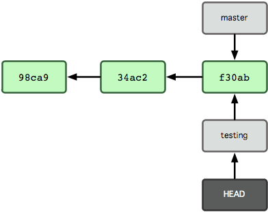

```{r setup, include=FALSE, purl=FALSE}
library("knitr")

options(htmltools.dir.version = FALSE)
  knitr::opts_chunk$set(fig.width=12, 
                        fig.height=12, 
                        eval=TRUE, 
                        cache=FALSE,
                        echo=TRUE,
                        prompt=FALSE,
                        tidy=FALSE,
                        comment=NA,
                        message=FALSE,
                        warning=TRUE,
                        highlight=TRUE,
                        fig.show='hold')
```

```{r, echo=FALSE, purl=FALSE}
# Define a function for formatting the dataframes

 my_kable <- function(df, nrows = 10){
   options(knitr.kable.NA = '') 
   knitr::kable(head(df, nrows),"html",row.names =FALSE, booktabs=T, linesep = "") %>%
      kableExtra::kable_styling(bootstrap_options = c("striped", "hover", "condensed"),font_size = 9 )
   }
```


layout: true
background-image: url(img/course-logo.png)
background-position: right top 30px 
background-size: 45%

# Fundamental of Data Science for EESS

---

<br>
<br>
<br>
<br>

## R session 06 - Git

.font120[**Daniel Vaulot**]

2019-03-15

<br>
<br>
<br>
.pull-left[
```{r, out.width="50%", echo=FALSE, fig.align="left", purl=FALSE}
knitr::include_graphics("img/NTU-Logo-full-colour.png")
```
]

.pull-right[
```{r, out.width="50%", echo=FALSE, fig.align="right", purl=FALSE}
knitr::include_graphics("img/logo_SBR.png")
```
]

---
layout: false
class: middle, inverse

# Outline


.font150[
* Git
* Commit and uncommit
* Branching and merging
* GitHub
]

---
layout: true

# Intro to Git

---

background-image: url(img/Linus_Torvalds.jpg),url(img/git-logo.png) 
background-position: right 10px top 10px, right 50px top 300px 
background-size: 15%,10%

## What is Git

* VCS: Version control system
* Created by Linus Torvald in 2005

--

## What is Git useful for

### Keep traces of all changes done to your work

--
* On your computer
    * Undo changes
    * Perform test on software you are developing 
    * Backup your work (`GitHub`)
* Team work
    * Collaborate with a small team (`GitHub`)
    * Participate into software development (`GitHub`)
    * Write paper in collaborative way (`Overleaf` - On-line Latex)
    * Provide supplementary data for your papers (`Figshare`)
...

---

.pull-left[
## Resources

* Pro GIT: https://git-scm.com/book/en/v2
* GitHub guide: https://guides.github.com
* Happy Git with R: https://happygitwithr.com/

## Software

* Git: https://git-scm.com
* Git desktop: https://github.com
* GitHub account: https://desktop.github.com

]

.pull-right[

```{r echo=FALSE, purl=FALSE, fig.align="center", fig.cap="", out.width='70%'}
knitr::include_graphics('img/Git-progit2.png')
```
]

---

## Version control system (VCS) - Traditional

```{r echo=FALSE, purl=FALSE, fig.align="center", fig.cap="", out.width='60%'}
knitr::include_graphics('img/git-storage-traditional.png')
```
<br>
* Store data as changes to a base version of each file
---

## Version control system (VCS) - Git

```{r echo=FALSE, purl=FALSE, fig.align="center", fig.cap="", out.width='60%'}
knitr::include_graphics('img/git-storage-git.png')
```

<br>
* Git takes a snapshot at each time
* Only stores what has changed
--

* Changes are stored in a **local database** inside your directory (.git)

---

## Three states for a file: committed, modified, and staged


```{r echo=FALSE, purl=FALSE, fig.align="center", fig.cap="", out.width='30%'}
knitr::include_graphics('img/git-structure.png')
```
* Need to be familiar with the vocabulary
--

* **Committed**: data is safely stored in your local database. 
--

* **Modified**: file changed BUT not committed in your database yet. 
--

* **Staged**: modified file is marked to go into your next commit snapshot.

---
layout: true

# Local Git - Committing

---
## Three different ways of committing
* Using R studio interface
* Using GitHub Desktop (my prefered)
* Using Git bash - The hard way

---
background-image: url(img/git-R.png)
background-position: right 20px top 20px
background-size: 20%

## Create R project and initialize Git

.student[
* Create a directory : git_01
* Create a new project
* Change Projet Options (Tools/Project Options/Git/Git)
* Restart the project
* Create a new Rmd file and save it
]
--

.student[
* On top-right window go Git tab
* Stage the files you want to commit
* gitignore
    * list file you do not want to save 
    * open it in Rstudio
    * Add 2 lines
* Commit
    * Must write a message explaining what you changed
]
---
background-image: url(img/git-R.png)
background-position: right 20px top 20px
background-size: 20%

## Commiting changes with R
.student[
* Make a new change to the Rmd file
* Stage and Commit
* R shows the differences
* Enter new comment and commit
]

--

.student[
* Click on history
* Each commit has a **hash** value
    * a80df29cc709e25db49cdfed11c0c1b0399d4a72
* Can open first version of the Rmd file
]
---
background-image: url(img/git-github-desktop.png)
background-position: right 20px top 20px
background-size: 25%


## Commit with GitHub Desktop
.student[
* Make a new change under R
* Save
* Open GitHub Desktop
]

--
.student[
* File/New repository
* Add existing repository
* Navigate to directory
]
--
.student[
* Commit change
* You can check in R the Commit
]
---
background-image: url(img/git-bash.png)
background-position: right 20px top 20px
background-size: 25%

## Commit with Git bash

.student[
* Make another change in the Rmd file
* Go to Git tab
* More / Shell...
]
--

.pull-left[
```{shell}
$ git status
$ git add git-01.Rmd
$ git status
$ git commit
```
.student[
* Surprise, surprise you are in the VIM editor
  * Enter the commit message
  * ESC - : - x - ENTER
* Check in GitHub Desktop
]
]

---
layout: true

# Local Git - Reverting

---
background-image: url(img/git-github-desktop.png)
background-position: right 20px top 20px
background-size: 25%


## Revert Commit with GitHub Desktop

.student[
* History
* Right-click : Revert Commit
]
--
.student[
* Go back to R
* Magic the changes have been reverted...
* Examine history (refresh if necessary)
* In fact revert is a **new commit**
]
---

background-image: url(img/git-bash.png)
background-position: right 20px top 20px
background-size: 25%

## Revert Commit with Git bash

.student[
* Find the hash of the commit you want to remove
]

.pull-left[

```{shell}
$ git log
$ git revert <hash>
$ git revert a80df29cc709e25db49cdfed11c0c1b0399d4a72
```
.student[
* Check in Rstudio the reversal
]
]

---
layout: true

# Local Git - Branching

---

## Why create branches


.font150[
* Testing
* Collaborative work
    * Different people can contribute and fix bugs
]

---
## How the data are stored

```{r echo=FALSE, purl=FALSE, fig.align="center", fig.cap="", out.width='40%'}
knitr::include_graphics('img/git-commit-00.png')
```
<br>
Three elements:
* **blobs** - contain the contents of the different files
* **tree** - pointer to the list of the blobs
* **commit** - pointer to the tree
---

## Commit

```{r echo=FALSE, purl=FALSE, fig.align="center", fig.cap="", out.width='60%'}
knitr::include_graphics('img/git-commit-01.png')
```

---

## The master branch

```{r echo=FALSE, purl=FALSE, fig.align="center", fig.cap="", out.width='60%'}
knitr::include_graphics('img/git-commit-02.png')
```
<br>
A branch in Git is simply a movable **pointer** to one commit. 

---

## Create a new branch

```{r echo=FALSE, purl=FALSE, fig.align="center", fig.cap="", out.width='45%'}
knitr::include_graphics('img/git-branch-01.png')
```

```{shell}
$ git branch testing
```

---

## Move the HEAD to the new branch

```{r echo=FALSE, purl=FALSE, fig.align="center", fig.cap="", out.width='45%'}

```

```{shell}
$ git checkout testing
```

---

## Make one commit on the testing branch

```{r echo=FALSE, purl=FALSE, fig.align="center", fig.cap="", out.width='60%'}
knitr::include_graphics('img/git-branch-03.png')
```

---

## Move the HEAD back to the master branch

```{r echo=FALSE, purl=FALSE, fig.align="center", fig.cap="", out.width='60%'}
knitr::include_graphics('img/git-branch-04.png')
```

```{shell}
$ git checkout master
```

---

## Do one commit on the master branch

```{r echo=FALSE, purl=FALSE, fig.align="center", fig.cap="", out.width='50%'}
knitr::include_graphics('img/git-branch-05.png')
```
<br>
* Now we have two diverging branches

---
background-image: url(img/git-branch-06.png)
background-position: right 20px top 20px
background-size: 50%

## Merging

.pull-left[
* Make sure you are on the master branch
```{shell}
$ git checkout master
```

* Merging

```{shell}
$ git merge testing
Auto-merging README
Merge made by the 'recursive' strategy.
 README | 1 +
 1 file changed, 1 insertion(+)
```
]

---

## After merging

```{r echo=FALSE, purl=FALSE, fig.align="center", fig.cap="", out.width='50%'}

```
<br>

--

* Now can delete the branch `testing`
<br>
```{shell}
$ git branch -d testing
```

---
background-image: url(img/git-R.png)
background-position: right 20px top 20px
background-size: 20%

## Let's do it using R studio
Could be done also with GitHub Desktop or Git bash

.student[
* Go to Git tab
* Create a new branch `test`or the name you want
]
--
* Notice that R creates the branch and switch to the branch

--

.student[
* Make some change in the Rmd file and save
* While on branch `test`, commit
* Go back and forth between the two branches `master` and `test`
]
--
* Observe how the Rmd file changes back and forth...
--
.student[
* Go to branch `master`
* Make some change in the Rmd file (elsewhere e.g. Plot) and save
* While on branch `master`, commit
]


---
background-image: url(img/git-github-desktop.png)
background-position: right 20px top 20px
background-size: 20%

## Merge back
Could be done also with Git bash

.student[
* Make sure you are on branch `master`
* Go to GitHub Desktop
* Branch / Merge into Current Branch
* Select the `master`
]

--

.student[
* Branch/Delete
* Choose `test`
* Look at history
]

* There can be conflicts
    * You need to edit file to solve the conflict
    

---
layout: true

# GitHub

---

## Upload your project to GitHub

.student[
* Go to GitHub Desktop
* Publish to Github
* Give a name
]

```{r echo=FALSE, purl=FALSE, fig.align="center", fig.cap="", out.width='80%'}

```

---

## GitHub

.student[
* Go to your GitHub account
* You should have a new repository
]

```{r echo=FALSE, purl=FALSE, fig.align="center", fig.cap="", out.width='50%'}

```

---
background-image: url(img/git-github-web-02.png)
background-position: right 20px top 20px
background-size: 50%

## Edit on GitHub

.student[
* Click on file Rmd
* Edit
* Commit
]

---

## Computer <--> Server synchronization

* How are we going to synchronize these changes back to our computer ?

--

```{r echo=FALSE, purl=FALSE, fig.align="center", fig.cap="", out.width='60%'}
knitr::include_graphics('img/git-push-pull.png')
```

* **Pull**: from server to computer
* **Push**: from computer to server

---

## Pull from server

.student[
* Go to GitHub desktop
* Fetch
* Pull
* Go to RStudio - What happened to your Rmd file
]
```{r echo=FALSE, purl=FALSE, fig.align="center", fig.cap="", out.width='55%'}

```

* If you make commits locally you need to **push** to server
* You can push several commits at once

---
background-image: url(img/git-pull-request.png)
background-position: center right 30px 
background-size: 55%

## Cloning a project from GitHub

```{r echo=FALSE, purl=FALSE, fig.align="center", fig.cap="", out.width='55%'}

```

---
background-image: url(img/git-pull-request.png)
background-position: center right 30px 
background-size: 55%

## Pull request
* You work on a project with someone else
* You cloned the project into your computer
* You created a new branch and made some change
* You want to merge back into the project

--

.student[
* R
    * Create a new branch `test2` and switch
    * Make some changes
    * Save and commit
* GitHub Desktop
    * Push changes to GitHub
    * Branch / Create a Pull Request
* GitHub
    * Validate the Changes and Merge into `master`
    * Delete the branch `test2`
]    
---
layout: false
class: middle, inverse

# Recap


.font150[
* Save and Commit
* Push and Pull
* Branching and merging (use only in multiuser projects)
]

---
layout: false
background-image: url(img/course-logo.png)
background-position: center bottom 30px 
background-size: 45%
class: center, inverse

.font200[**C'est fini...**]


